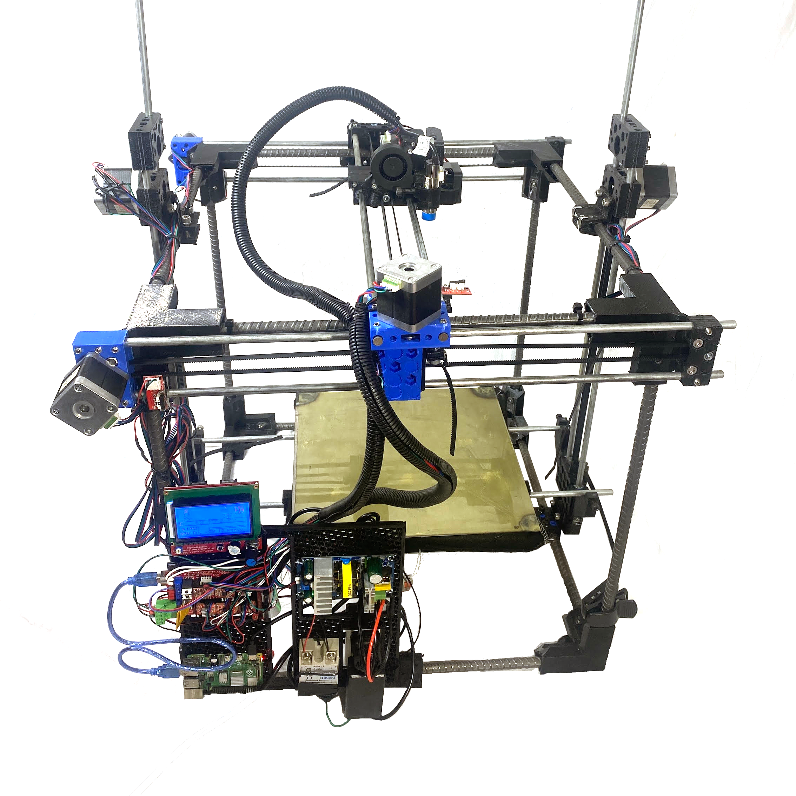

= D3D Pro 3D Printer

=== https://alexandrialittle.github.io/d3d-pro/[Click HERE for the Documentation Page!]

Modeled in Legacy DOF (Distributed Open Source Hardware Framework)

== Frequently Asked Questions:

=== Who is this printer for? Why should I build this printer?
- This printer is designed for the hobbyist, the "prosumer", and anyone who needs industrial productivity on a small scale. The D3D Pro 3D Printer is designed to be user repairable for life - i.e. not planned obsolesence / planned failure. It is made entirely from common-off-the-shelf components so that sourcing the materials for the build and for repair is easy and quick. If you need a machine that will last you your entire life, this is the one for you!

=== What features does the D3D Pro have? What is it capable of?
* The D3D Pro has automatic bed leveling, printing over WIFI, advanced Marlin firmware features including Input Shaping and Linear (Pressure) Advance, a gearless extruder with an open filament path, superior performance with flexable filaments (due to the short distance between filament drive point and melt zone), a standardized Universal Axis motion system, and much more.
* The D3D Pro is capable of printing strong, industrial quality parts quickly with good print precision and robust performance.

=== What is the print volume?
* The D3D Pro printer has a 300mm x 300mm x 300mm print volume. Is that not enough for your needs? The printer is also fully scalable!

=== What does "modular" mean for this 3D Printer?
* The D3D Pro is broken up into six modules - The Univeral Axis, the Universal Frame, the Universal Controller, the Universal Gearless Extruder, the Fast Heated Bed, and the Filament Spool Holder. These modules can be used for many things beyond just a 3D Printer, including other CNC machines, camera sliders, a personal computer, a robot controller, a miltipurpose heated surface, and more! More modules can be added to the 3D Printer to increase its performance capabilities. For example, more Universal Axes can be added to increase bed lift, additional Universal Controllers and Universal Gearless Extruders can be added for higher throughput, etc.

=== What does "fully scalable" mean for this printer?
* Because the printer uses standardized modular components, it can be modified to be much larger in size if necessary for your use case. Simply increase the size of the frame, axes rods and belts, and heated bed, extend the wires, and you're all but good to go! Additional axes can be added to the printer easily to increase the bed lift capacity or provide a more rigid axis.

=== What materials can it print?
* The printer can print any 3D Printing filament of 2.85mm or 1.75mm diameter (depending on how you build the extruder) up a maximum temperature of 285C. The heated bed surface can reach a temperature of 100C+. The has been verified to work with common printer filaments like PLA, PETG, PET, and ASA.

=== Why are all of the axes belt-driven?
* The standardized Universal Axis motion system is fully belt-driven to simplify the machine's design, make maintenance a breeze, and allow for part interchangeability.

=== Why is the frame made out of rebar?
* Rebar is an inexpensive, robust, and strong material that comes in stock lengths of up to 20'. This helps the printer scale up if necessary for litte extra cost while providing a solid frame for the machine to operate in.

=== Why is the extruder "gearless"?
* The D3D Pro uses the Universal Gearless Extruder for its open filament path, making the job of clearing any possible clogs a simple task. The gearless design is also simpler, requires less maintenance, has lower cost replacement parts, and provides superior performance with soft, flexible filaments due to the short distance between the point where the filament is driven by the extruder gear and the melt zone.

=== How fast does it print?
* With the proper slicer settings and tuning of Marlin firmware's advanced features, the printer has been able to reliably print at speeds as fast as 80mm/s - 100mm/s at an acceleration of 3000mm/s^2. (0.4mm nozzle at 0.2mm layer height)

=== What is the volumetric flow rate of the hotend?
* The D3D Pro uses a Volcano style hotend, the specifications of which can be found here: https://e3d-online.com/products/volcano-hotend[E3D Volcano Hotend Product Page]

=== What are the machine dimensions?
* (675mm Wide x 665mm Deep x 645mm Tall) without the filament spool holder
* (675mm Wide x 665mm Deep x 960mm Tall) (approx.) with the filament spool holder
* (26.5" Wide x 26" Deep x 25.25" Tall) (approx.) without filament spool holder
* (26.5" Wide x 26" Deep x 37.5" Tall) (approx.) with filament spool holder

=== I want to build one! Where can I get parts and tools?
* Many of the parts for the printer can be purchased from the local hardware store. For example, you can get the fasteners, all of the heated bed components, the rebar frame members, the rods for the Universal Axes, etc. at your local Lowe's, Menards, Home Depot, etc. Some of the more specific 3D Printer components can be sourced from online retailers like Amazon, eBay, Aliexpress, etc. All of the tools should be available at the hardware store as well! Lastly, the 3D Printed components can be printed from the source files provided (if you have access to a 3D Printer already), or ordered from a 3D printing service or a friend with a printer. :)

== Contributors:
- Alexandria Little
- Marcin Jakubowski, Ph.D.
- Sean Marquez
- J. Simmons, Ph.D.
- Eric Lotze (One of the original 3D printer devs)
- Irvin Inzurriaga (Wiring Video)
- Jean-Baptiste Vervaeck (Graphic design of original documentation template)
- Printables User @OK1HRA_5209 - https://www.printables.com/model/716371-parameterizable-rugged-box-in-openscad[Parameterizable rugged box in OpenScad] (CC-BY-SA-4.0)
