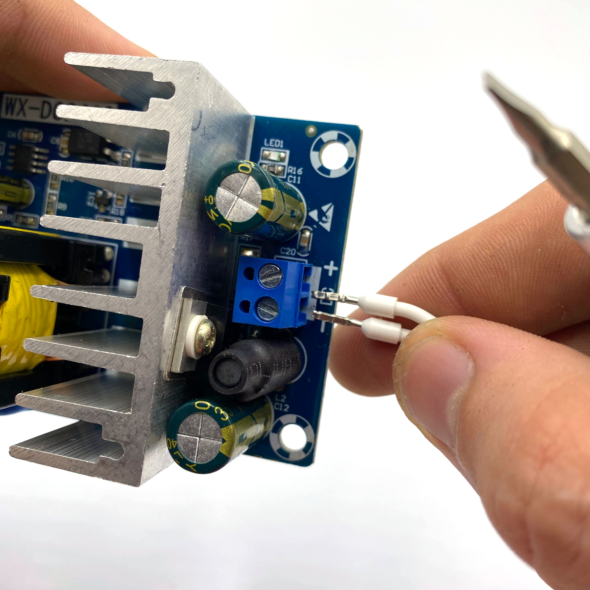
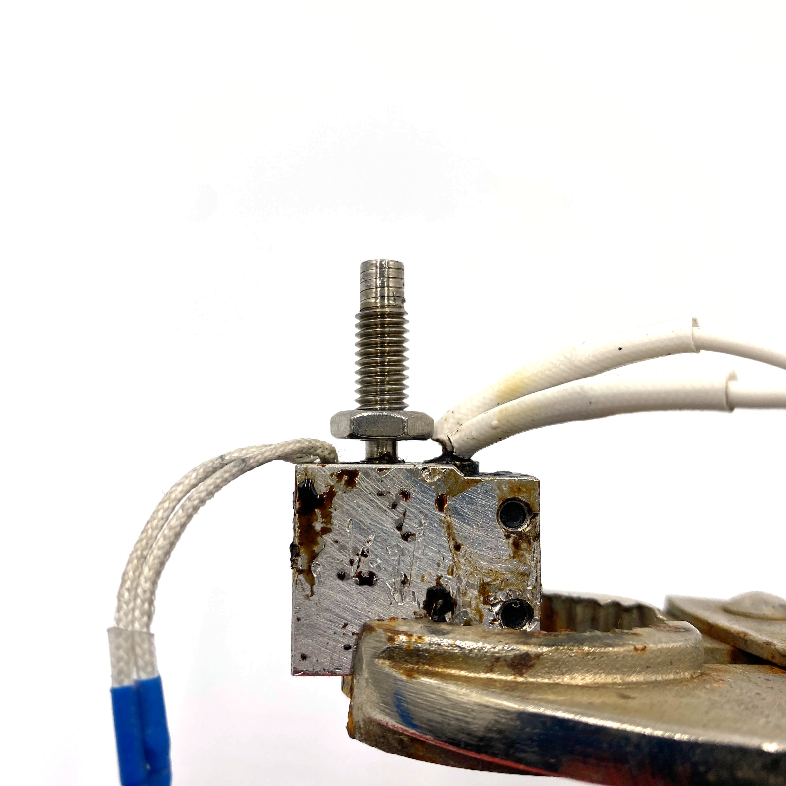
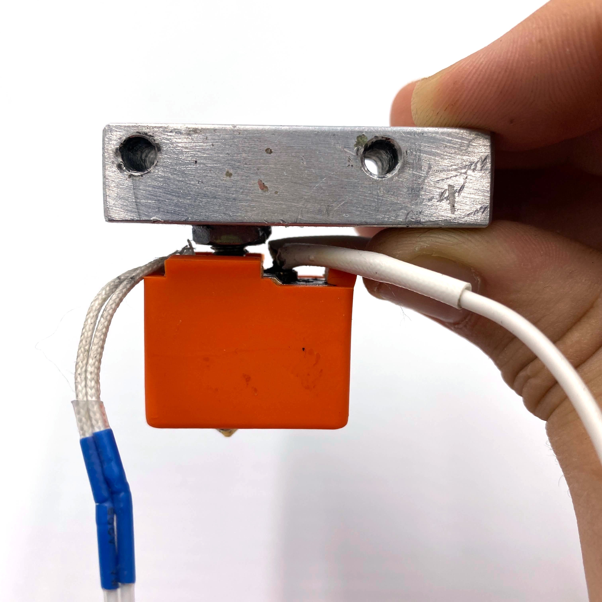

= D3D Pro 3D Printer Assembly Instructions
Alexandria Little - CC-BY-SA-4.0
:revnumber: v23.12
:revdate: 10/14/2024
:sectnums:
:toc:
:toclevels: 3
:docinfo: shared
// :docinfodir: dist/

include::preamble.adoc[]

// github specific things
ifdef::env-github[]
:tip-caption: :bulb:
:note-caption: :information_source:
:important-caption: :heavy_exclamation_mark:
:caution-caption: :fire:
:warning-caption: :warning:
:imagesdir: https://github.com/AlexandriaLittle/d3d-pro
endif::[]

// non-github specific things
ifndef::env-github[]
:imagesdir: ./images
endif::[]

include::flatPartsBOM.adoc[]
include::flatToolsBOM.adoc[]

== Assemble Rebar Stake

// tools

=== Tools
|===
|Name |Description |Notes

|Circular Saw
|Circular Saw
|

|Cutoff Wheel
|Metal Cutoff Wheel
|Make sure that the cutoff wheel that you purchase is compatible with your cutting tool!

|Vise
|Metal Jaw Vise
|

|Measuring Tape
|Measuring Tape
|

|Permanent Marker
|Permanent Marker
|

|===

// materials

=== Materials
|===
|Quantity |ID |Name |Description |Notes

|1 part
|rebar-stake-stock-length
|Rebar Stake Stock Length
|12.7mm Rebar Stake Stock Length v1.0.0
|

|===

// Precautions

=== Precautions

* *Circular Saw:* A Circular Saw can cause permenent injury or death! Follow all manufacturer recommended safety precautions!

// Procedure
=== Procedure

// summary

==== Cut Rebar Stake to Length

// requiredTools
//
//*Required Tools*
//
//* Circular Saw
//
//* Cutoff Wheel
//
//* Vise
//
//* Measuring Tape
//
//* Permanent Marker
//
//

// requiredParts
//
//*Required Parts*
//
//* Rebar Stake Stock Length
//
//

// details

*Instructions*

. While following the *Circular Saw* manufacturer's instructions, install the *Cutoff Wheel* into the *Circular Saw*.
. Affix the *Rebar Stake Stock Length* into the *Vise*, leaving enough *Rebar Stake Stock Length* sticking out to make the cut.
. Mark the 450mm length on the *Rebar Stake Stock Length* using the *Measuring Tape* and *Permanent Marker*. Make sure that there is enough space marked for the width of the *Cutoff Wheel*!
. Using the *Circular Saw*, make the cut on the *Rebar Stake Stock Length* where previously marked.
. Repeat the above steps for all of the needed lengths of *Rebar Stake*.

== Assemble Universal Frame Module

// tools

=== Tools
|===
|Name |Description |Notes

|5mm Allen Wrench
|5mm Allen Wrench
|

|Hobby Knife
|Hobby Knife
|

|===

// materials

=== Materials
|===
|Quantity |ID |Name |Description |Notes

|12 part(s)
|rebar-stake
|Rebar Stake
|Rebar Stake v1.0.0
|

|24 part(s)
|m6-20mm-screw
|M6 x 20mm Screw
|M6 x 20mm Socket Head Cap Screw v1.0.0
|

|24 part(s)
|m6-thin-nut
|M6 Thin Nut
|M6 Thin Nut v1.0.0
|

|4 part(s)
|corner-connector
|Corner Connector
|Universal Frame Corner Connector v1.0.0
|

|2 part(s)
|corner-connector-left
|Left Corner Connector
|Universal Frame Corner Connector Left v1.0.0
|

|2 part(s)
|corner-connector-right
|Right Corner Connector
|Universal Frame Corner Connector Right v1.0.0
|

|===

// Precautions

// Procedure
=== Procedure

// summary

==== Clean 3D Printed Parts

// requiredTools
//
//*Required Tools*
//
//* Hobby Knife
//
//

// requiredParts
//
//*Required Parts*
//
//* Left Corner Connector
//
//* Right Corner Connector
//
//* Corner Connector
//
//

// details

*Instructions*

. Use the *Hobby Knife* to clean any extra plastic off of the 3D printed parts.

// summary

==== Prepare Corner Connector part(s), Left Corner Connector part(s), and Right Corner Connector part(s) for Rebar Stake part(s)

// requiredTools
//
//*Required Tools*
//
//* 5mm Allen Wrench
//
//

// requiredParts
//
//*Required Parts*
//
//* Corner Connector
//
//* M6 x 20mm Screw
//
//* M6 Thin Nut
//
//

// details

*Instructions*

. Insert an *M6 Thin Nut* into the slot of the *Corner Connector* so that the hole of the *M6 Thin Nut* aligns with the hole in the *Corner Connector*.
. While holding the *M6 Thin Nut* in place with a finger, insert an *M6 x 20mm Screw* into the hole of the *Corner Connector*.
. Using the *5mm Allen Wrench*, screw in the *M6 x 20mm Screw* enough to hold the *M6 x 20mm Screw* and *M6 Thin Nut* in place. Leave room for the *Rebar Stake* to be inserted later.
. Repeat the above steps for each of the three slots on the *Corner Connector*.
. Repeat each of the above steps for the *Corner Connector* part(s), *Left Corner Connector* part(s), and *Right Corner Connector* part(s)

// summary

==== Assemble Universal Frame Base

// requiredTools
//
//*Required Tools*
//
//* 5mm Allen Wrench
//
//

// requiredParts
//
//*Required Parts*
//
//* Corner Connector
//
//* Rebar Stake
//
//

// details

*Instructions*

. Insert one *Rebar Stake* into a slot on the *Corner Connector*.
. Press the *Rebar Stake* down hard into the slot so that the part(s) are flush with the bottom of the slot. This step is important to ensure squareness in the frame.
. Using the *5mm Allen Wrench*, screw down the *M6 x 20mm Screw* in against the *Rebar Stake* until it is tight. If the plastic of the *Corner Connector* begins to strain or crack, unscrew the *M6 x 20mm Screw* slightly to reduce the pressure.
. Insert the other end of the *Rebar Stake* into another *Corner Connector* and repeat the above steps to press and tighten down the *Corner Connector*.
. Repeat the above steps so that there are two completed *Rebar Stake* part(s) with *Corner Connector* part(s) on the ends.
. Insert two *Rebar Stake* part(s) into the completed *Rebar Stake* part(s) from the previous step so that a square is formed.
. Press the square together hard to seat the *Corner Connector* part(s) onto the *Rebar Stake* part(s).
. Tighten the four loose *M6 x 20mm Screw* part(s) down onto the *Rebar Stake* part(s) to complete the *Universal Frame Module Base*. As above, if the plastic of the *Corner Connector* part(s) begins to strain or crack, unscrew the *M6 x 20mm Screw* slightly to reduce the pressure.
. The *Universal Frame Base* is complete.

// summary

==== Assemble Universal Frame Top

// requiredTools
//
//*Required Tools*
//
//* 5mm Allen Wrench
//
//

// requiredParts
//
//*Required Parts*
//
//* Left Corner Connector
//
//* Right Corner Connector
//
//* Rebar Stake
//
//

// details

*Instructions*

. Orient the *Left Corner Connector* part(s) and *Right Corner Connector* part(s) so that they are all laying flat against the table. There should only be one orientation where the parts lay flat, and this orientation should be maintained throughout the following steps for the sake of clarity.
. Organize the above parts such that the *Left Corner Connector* part(s) will be on opposite corners of the square that will be formed in later steps.
. Perform the above step again for the *Right Corner Connector* part(s) to lay out the final orientation of the parts.
. Insert one *Rebar Stake* into a side slot on a *Left Corner Connector*. Do not insert the *Rebar Stake* part(s) into the slot that is pointing up in this step.
. Press the *Rebar Stake* hard into the slot so that the part(s) are flush with the bottom of the slot. This step is important to ensure squareness in the frame.
. Using the *5mm Allen Wrench*, screw down the *M6 x 20mm Screw* in against the *Rebar Stake* until it is tight. If the plastic of the *Left Corner Connector* begins to strain or crack, unscrew the *M6 x 20mm Screw* slightly to reduce the pressure.
. Insert the other end of the *Rebar Stake* from the above steps into the corresponding *Right Corner Connector* and repeat the above steps to press and tighten down the *Right Corner Connector*.
. Repeat the above steps so that there are two completed *Rebar Stake* part(s) with *Left Corner Connector* part(s) and *Right Corner Connector* part(s) on the ends.
. Insert two *Rebar Stake* part(s) into the completed *Rebar Stake* part(s) from the previous step so that a square is formed.
. Press the square together hard to seat the *Left Corner Connector* part(s) and *Right Corner Connector* part(s) onto the *Rebar Stake* part(s).
. Tighten the four loose *M6 x 20mm Screw* part(s) down onto the *Rebar Stake* part(s). As above, if the plastic of the *Left Corner Connector* part(s) or *Right Corner Connector* part(s) begins to strain or crack, unscrew the *M6 x 20mm Screw* slightly to reduce the pressure.
. The *Universal Frame Top* is complete.

// summary

==== Assemble Universal Frame Module

// requiredTools
//
//*Required Tools*
//
//* 5mm Allen Wrench
//
//

// requiredParts
//
//*Required Parts*
//
//* Rebar Stake
//
//* 
//
//* 
//
//

// details

*Instructions*

. Orient the *Universal Frame Base* so that the open slots point upward.
. Insert the four *Rebar Stake* part(s) into the slots of the *Universal Frame Base*.
. Firmly press each *Rebar Stake* part(s) into the *Universal Frame Base* so that they are flush with the bottom of the slots in the *Universal Frame Base*.
. Tighten down all of the remaining fasteners on the *Universal Frame Base* to secure the *Rebar Stake* part(s) in place. If the plastic of the *Universal Frame Base* begins to strain or crack, unscrew the fastener slightly to reduce the pressure.
. Orient the *Universal Frame Top* so that the open slots point upward.
. Align the *Universal Frame Top* over the four *Rebar Stake* part(s) that are connected to the *Universal Frame Base* and press the Universal Frame Top onto the *Rebar Stake* part(s).
. Firmly press the *Universal Frame Top* down onto the *Universal Frame Base* so that the *Rebar Stake* part(s) are properly seated.
. Tighten down all of the remaining fasteners on the *Universal Frame Top* to secure the *Universal Frame Top* onto the *Rebar Stake* part(s). If the plastic of the *Universal Frame Base* begins to strain or crack, unscrew the fastener slightly to reduce the pressure.
. The *Universal Frame Module* is complete.

== Assemble Carbon Fiber Blanket Sleeve

// tools

=== Tools
|===
|Name |Description |Notes

|Sewing Machine
|Sewing Machine
|Optionally, use a needle and thread to hand sew components.

|Scissors
|Scissors
|

|===

// materials

=== Materials
|===
|Quantity |ID |Name |Description |Notes

|1 part(s)
|carbon-fiber-blanket-stock
|Carbon Fiber Blanket
|Carbon Fiber Blanket (Stock Size) v1.0.0
|

|1 part(s)
|sewing-thread
|Sewing Thread
|Sewing Thread v1.0.0
|

|===

// Precautions

// Procedure
=== Procedure

// summary

==== Assemble Carbon Fiber Blanket Sleeve Parts

// requiredTools
//
//*Required Tools*
//
//* Sewing Machine
//
//* Scissors
//
//

// requiredParts
//
//*Required Parts*
//
//* Carbon Fiber Blanket
//
//* Sewing Thread
//
//

// details

*Instructions*

. Using the *Scissors*, cut four rectangles of *Carbon Fiber Blanket* to size (80mm x 300mm).
. Set up the *Sewing Machine* and *Sewing Thread* by following the manufacturer's instructions for the *Sewing Machine*.
. Overlap/fold one rectangle of *Carbon Fiber Blanket* so that it forms a 40mm x 300mm rectangle.
. Using the *Sewing Machine*, sew the 300mm long edges of the rectangle together. It should form a 300mm long sleeve.
. Repeat the previous two steps for all of the remaining *Carbon Fiber Blanket* rectangles.
. Take one of the *Carbon Fiber Blanket Sleeve* parts and use *Scissors* to cut "X" shapes near the ends of the sleeve. The center of the "X" cuts should be approx. 20mm from each edge.
. Repeat the above step for all of the remaining *Carbon Fiber Blanket Sleeve* parts.
. The *Carbon Fiber Blanket Sleeve* parts are complete.

== Assemble Halogen Lightbulb Assembly

// tools

=== Tools
|===
|Name |Description |Notes

|Soldering Iron
|Soldering Iron
|

|Helping Hands
|Helping Hands Clamp Stand
|

|Paper Towels
|Paper Towels
|

|Heat Source
|Lighter
|A heat gun, a lighter, etc.

|Scissors
|Scissors
|

|Wire Strippers/Cutters
|Wire Stripper/Cutter
|

|===

// materials

=== Materials
|===
|Quantity |ID |Name |Description |Notes

|3 part(s)
|halogen-lightbulb
|Halogen Lightbulb
|R7S 118mm Halogen Lightbulb v1.0.0
|

|3 part(s)
|halogen-lightbulb-holder
|Halogen Lightbulb Holder
|R7S 118mm Halogen Lightbulb Holder v1.0.0
|

|2 application(s)
|electrical-solder
|Electrical Solder
|Rosin Core Lead Free Electrical Solder v1.0.0
|

|2 part(s)
|heat-shrink-tubing
|Heat Shrink Tubing
|Heat Shrink Tubing v1.0.0
|

|4 part(s)
|metal-zip-tie
|Metal Zip Tie
|Metal Zip Tie v1.0.0
|

|1 part(s)
|carbon-fiber-blanket-stock
|Carbon Fiber Blanket
|Carbon Fiber Blanket (Stock Size) v1.0.0
|

|===

// Precautions

=== Precautions

* *Halogen Lightbulb Assembly:* If oils from skin contact or other debris get on the Halogen Lightbulb part(s) they can be cleaned while at room temperature with rubbing alcohol and a clean paper towel.

* *Halogen Lightbulb Assembly:* Halogen Lightbulb part(s) require special handling. Make sure to not touch the Halogen Lightbulb part(s) in the assembly with bare hands or they will be damaged during operation! The lifetime of a Halogen Lightbulb is reduced dramatically if operated while dirty.

* *Soldering Iron:* A Soldering Iron gets very very hot and can burn you! Follow all of the manufacturer recommended safety precautions when using a Soldering Iron!

* *Electrical Solder:* Rosin Core Lead Free Electrical Solder can contain toxic chemicals! Always work in a well ventialted area and use personal protection equipment!

// Procedure
=== Procedure

// summary

==== Solder the Halogen Lightbulb Holder part(s)

// requiredTools
//
//*Required Tools*
//
//* Soldering Iron
//
//* Wire Strippers/Cutters
//
//

// requiredParts
//
//*Required Parts*
//
//* Halogen Lightbulb Holder
//
//* Electrical Solder
//
//

// details

*Instructions*

. If necessary, use the *Wire Strippers/Cutters* to strip the ends of all of the *Halogen Lightbulb Holder* wires.
. Preheat the *Soldering Iron* to the operating temperature recommended by the *Electrical Solder* packaging.
. Slide a *Heat Shrink Tubing* part(s) over one of the wires of a *Halogen Lightbulb Holder*.
. Position one wire of one of the *Halogen Lightbulb Holder* part(s) and the wire with *Heat Shrink Tubing* from the previous step in the *Helping Hands* so that the exposed ends of the wires are touching. It may help to twist the wires together so that they stay in place during soldering.
. Make sure that the *Heat Shrink Tubing* is out of the way of the exposed wire.
. Hold the hot end of the *Soldering Iron* against the exposed wires in the *Helping Hands* for a few seconds to heat the wires.
. Apply *Electrical Solder* to the contact point between the hot end of the *Soldering Iron* and the exposed wires until enough has been added to fuse the wires and make a good electrical connection.
. Once the *Electrical Solder* has been applied, set the *Electrical Solder* aside and continue to hold the soldering iron to the soldered wires for a few seconds to allow the solder to flow up the wires.
. Remove the hot end of the *Soldering Iron* from the wires.
. Wait for the wires to cool and then remove them from the *Helping Hands*. 
. Slide the *Heat Shrink Tubing* across the soldered area and use a *Heat Source* to shrink the *Heat Shrink Tubing* over the wires.
. Take the other wire of one of the previously soldered *Halogen Lightbulb Holder* part(s), slide a *Heat Shrink Tubing* part(s) onto the wire, and position it in the *Helping Hands*.
. Position one of the wires of the remaining *Halogen Lightbulb Holder* part(s) in the unused side of the *Helping Hands*.
. Hold the hot end of the *Soldering Iron* against the exposed wires in the *Helping Hands* for a few seconds to heat the wires.
. Apply *Electrical Solder* to the contact point between the hot end of the *Soldering Iron* and the exposed wires until enough has been added to fuse the wires and make a good electrical connection.
. Once the *Electrical Solder* has been applied, set the *Electrical Solder* aside and continue to hold the soldering iron to the soldered wires for a few seconds to allow the solder to flow up the wires.
. Remove the hot end of the *Soldering Iron* from the wires.
. Wait for the wires to cool and then remove them from the *Helping Hands*.

// summary

==== Insulate the soldered connections

// requiredTools
//
//*Required Tools*
//
//* Scissors
//
//* Wire Strippers/Cutters
//
//

// requiredParts
//
//*Required Parts*
//
//* Halogen Lightbulb Holder
//
//* Metal Zip Tie
//
//* Carbon Fiber Blanket
//
//

// details

*Instructions*

. Cut two pieces of the *Carbon Fiber Blanket* to size (75mm x 75mm) using *Scissors*.
. Wrap one piece of the *Carbon Fiber Blanket* over one of the *Heat Shrink Tubing* part(s).
. Use two *Metal Zip Tie* part(s) to secure each end of the *Carbon Fiber Blanket* part(s). This should fully cover the *Heat Shrink Tubing*.
. Perform the above steps again over the remaining *Heat Shrink Tubing* part(s).
. Optionally, cut the excess *Metal Zip Tie* off using *Wire Strippers/Cutters*.

// summary

==== Add Halogen Lightbulb part(s)

// requiredTools
//
//*Required Tools*
//
//* Paper Towels
//
//

// requiredParts
//
//*Required Parts*
//
//* Halogen Lightbulb
//
//* Halogen Lightbulb Holder
//
//

// details

*Instructions*

. Using *Paper Towels*, remove a *Halogen Lightbulb* part(s) from its packaging material and insert it into one of the *Halogen Lightbulb Holder* part(s). Be careful to not touch the *Halogen Lightbulb* with your hands (see precautions).
. Repeat the above step for each of the other *Halogen Lightbulb Holder* part(s)*.
. The *Halogen Lightbulb Assembly* is now complete.

== Assemble Metal Conduit

// tools

=== Tools
|===
|Name |Description |Notes

|Circular Saw
|Circular Saw
|

|Cutoff Wheel
|Metal Cutoff Wheel
|Make sure that the cutoff wheel that you purchase is compatible with your cutting tool!

|Vise
|Metal Jaw Vise
|

|Measuring Tape
|Measuring Tape
|

|Permanent Marker
|Permanent Marker
|

|===

// materials

=== Materials
|===
|Quantity |ID |Name |Description |Notes

|1 part
|conduit-stock-length
|Stock Length Metal Conduit
|Stock Length Metal Conduit v1.0.0
|

|===

// Precautions

=== Precautions

* *Circular Saw:* A Circular Saw can cause permenent injury or death! Follow all manufacturer recommended safety precautions!

// Procedure
=== Procedure

// summary

==== Cut Metal Conduit to Length

// requiredTools
//
//*Required Tools*
//
//* Circular Saw
//
//* Cutoff Wheel
//
//* Vise
//
//* Measuring Tape
//
//* Permanent Marker
//
//

// requiredParts
//
//*Required Parts*
//
//* Stock Length Metal Conduit
//
//

// details

*Instructions*

. While following the *Circular Saw* manufacturer's instructions, install the *Cutoff Wheel* into the *Circular Saw*.
. Affix the *Stock Length Metal Conduit* into the *Vise*, leaving enough *Stock Length Metal Conduit* sticking out to make the cut.
. Mark the 250mm length on the *Stock Length Metal Conduit* using the *Measuring Tape* and *Permanent Marker*. Make sure that there is enough space marked for the width of the cutting blade!
. Using the *Circular Saw*, make the cut on the *Stock Length Metal Conduit* where previously marked.
. Repeat the above steps for all of the needed lengths of *Metal Conduit*.

== Assemble Fast Heated Bed Bottom Plate

// tools

=== Tools
|===
|Name |Description |Notes

|Plate Jig
|Fast Heated Bed Plate Jig
|

|Permanent Marker
|Permanent Marker
|

|Drill Press
|Drill Press
|

|7mm Drill Bit
|7mm Sheet Metal Drill Bit
|

|Metal File
|Metal File
|

|===

// materials

=== Materials
|===
|Quantity |ID |Name |Description |Notes

|1 part
|steel-sheet
|Steel Sheet
|16 Gauge 300mm x 300mm Steel Sheet v1.0.0
|

|===

// Precautions

=== Precautions

* *Drill Press:* Drill presses can cause permanent injury or possibly death! Do not wear loose fitting clothing, put your hair up, and wear proper PPE including (but not limited to) safety glasses when operating the machine.

// Procedure
=== Procedure

// summary

==== Drill the Fast Heated Bed Bottom Plate

// requiredTools
//
//*Required Tools*
//
//* Plate Jig
//
//* Permanent Marker
//
//* Drill Press
//
//* 7mm Drill Bit
//
//* Metal File
//
//

// requiredParts
//
//*Required Parts*
//
//* Steel Sheet
//
//

// details

*Instructions*

. Align the *Plate Jig* to one of the corners of the *Steel Sheet*.
. In each of the holes on the *Plate Jig*, mark a circle the size of the hole using the *Permanent Marker*.
. Insert the *7mm Drill Bit* into the chuck of the *Drill Press* and secure it tightly per the manufacturer's instructions.
. Turn on the drill press and drill holes through each of the marks made on the *Steel Sheet* in the earlier steps.
. Using the *Metal File*, file down any metal burrs created by the *Drill Press* on the *Steel Sheet*.

== Assemble Fast Heated Bed Top Plate

// tools

=== Tools
|===
|Name |Description |Notes

|Plate Jig
|Fast Heated Bed Plate Jig
|

|Permanent Marker
|Permanent Marker
|

|Vise Grip Pliers
|Vise Grip Pliers
|

|Welder
|Welder
|

|Welding Brush
|Wire Welding Brush
|

|===

// materials

=== Materials
|===
|Quantity |ID |Name |Description |Notes

|1 part
|steel-sheet
|Steel Sheet
|16 Gauge 300mm x 300mm Steel Sheet v1.0.0
|

|4 part(s)
|m6-25mm-screw
|M6 x 25mm Screw
|M6 x 25mm Socket Head Cap Screw v1.0.0
|

|===

// Precautions

=== Precautions

* *Welder:* DO NOT ATTEMPT TO WELD WITHOUT PROPER PERSONAL PROTECTIVE EQUIPMENT AND PROPER TRAINING. If necessary, have this part fabricated by someone who can safely perform the work.

* *Welder:* Welding is an operation that can be harmful or FATAL if done improperly. Follow all instructions and precautions included with the Welder and use common sense!

// Procedure
=== Procedure

// summary

==== Prepare the Steel Sheet for Welding

// requiredTools
//
//*Required Tools*
//
//* Plate Jig
//
//* Welding Brush
//
//* Permanent Marker
//
//

// requiredParts
//
//*Required Parts*
//
//* Steel Sheet
//
//

// details

*Instructions*

. Use the *Welding Brush* on the *Steel Sheet* to scrape off any surface impurities near the corners where the welds will occur.
. Align the *Plate Jig* to one of the corners of the *Steel Sheet*.
. In each of the holes on the *Plate Jig*, mark a circle the size of the hole using the *Permanent Marker*.

// summary

==== Weld the M6 x 25mm Screw part(s) to the Steel Sheet

// requiredTools
//
//*Required Tools*
//
//* Welder
//
//* Vise Grip Pliers
//
//

// requiredParts
//
//*Required Parts*
//
//* Steel Sheet
//
//* M6 x 25mm Screw
//
//

// details

*Instructions*

. Using *Vise Grip Pliers*, secure a *M6 x 25mm Screw* over one of the *Plate Jig* circles drawn previously.
. While wearing proper safety equipment, spot weld the *M6 x 25mm Screw* to the *Steel Sheet* using the *Welder*.
. Repeat the above steps for the remaining *Plate Jig* marks until there are a total of four *M6 x 25mm Screw* part(s) in the locations indicated by the *Plate Jig*.
. Clean off the welding marks on both sides of the *Steel Sheet* using the *Welding Brush*.

== Assemble Fast Heated Bed Module

// tools

=== Tools
|===
|Name |Description |Notes

|Slip Joint Pliers
|Slip Joint Pliers
|

|5mm Allen Wrench
|5mm Allen Wrench
|

|===

// materials

=== Materials
|===
|Quantity |ID |Name |Description |Notes

|2 part(s)
|8mm-rod
|8mm Rod
|8mm x 600mm Smooth Rod v1.0.0
|

|2 part(s)
|autoparallel
|Autoparallel
|Autoparallel Part v1.0.0
|

|1 part
|top-plate
|Fast Heated Bed Top Plate
|Fast Heated Bed Top Plate v1.0.0
|

|1 part
|bottom-plate
|Fast Heated Bed Bottom Plate
|Fast Heated Bed Bottom Plate v1.0.0
|

|2 part(s)
|clamp
|Fast Heated Bed Clamp
|Fast Heated Bed Clamp v1.0.0
|

|4 part(s)
|conduit
|Metal Conduit
|Metal Conduit v1.0.0
|

|2 part(s)
|corner-brace
|Corner Brace
|2 inch x 5/8 Inch Corner Brace (Four Holes) v1.0.0
|

|1 part
|lightbulb-assembly
|Halogen Lightbulb Assembly
|Halogen Lightbulb Assembly v1.0.0
|

|4 part(s)
|m6-20mm-screw
|M6 x 20mm Screw
|M6 x 20mm Socket Head Cap Screw v1.0.0
|

|8 part(s)
|m6-nut
|M6 Nut
|M6 Nut v1.0.0
|

|1 part
|pei-sheet
|PEI Sheet
|300mm x 300mm PEI Sheet v1.0.0
|

|4 part(s)
|sleeve
|Carbon Fiber Blanket Sleeve
|Carbon Fiber Blanket Sleeve v1.0.0
|

|1 part
|thermistor
|Thermistor
|NTC 100K ohm B3950 Thermistor Cartridge v1.0.0
|

|===

// Precautions

=== Precautions

* *Halogen Lightbulb Assembly:* If oils from skin contact or other debris get on the Halogen Lightbulb part(s) they can be cleaned while at room temperature with rubbing alcohol and a clean paper towel.

* *Halogen Lightbulb Assembly:* Halogen Lightbulb part(s) require special handling. Make sure to not touch the Halogen Lightbulb part(s) in the assembly with bare hands or they will be damaged during operation! The lifetime of a Halogen Lightbulb is reduced dramatically if operated while dirty.

// Procedure
=== Procedure

// summary

==== Assemble Fast Heated Bed Module

// requiredTools
//

// requiredParts
//

// details

*Instructions*

. Slide one *Carbon Fiber Blanket Sleeve* part(s) over one *Metal Conduit* so that the *Metal Conduit* is in the middle of the *Carbon Fiber Blanket Sleeve*.
. Repeat the above step for the three other pairs of *Carbon Fiber Blanket Sleeve* part(s) and *Metal Conduit* part(s).
. Orient the *Fast Heated Bed Top Plate* so that the screws are on top.
. Take one of the *Metal Conduit* / *Carbon Fiber Blanket Sleeve* part(s) and align the "X" cuts on the ends of the *Carbon Fiber Blanket Sleeve* with two bolts on the side of the *Fast Heated Bed Top Plate*. 
. Repeat the above step for all four sides of the *Fast Heated Bed Top Plate*.
. Without touching the bulbs, place the *Halogen Lightbulb Assembly* onto the center of the *Fast Heated Bed Top Plate*.
. Pull the wires of the *Halogen Lightbulb Assembly* out past one side of the *Fast Heated Bed Top Plate* so that the wires can be reached in a later step.
. Take four *M6 Nut* part(s) and screw one onto every screw on the *Fast Heated Bed Top Plate*.
. Position the *Fast Heated Bed Bottom Plate* onto the screws of the *Fast Heated Bed Top Plate*. The *Fast Heated Bed Bottom Plate* should rest on top of the *M6 Nut* part(s) from the previous step.
. Take four *M6 Nut* part(s) and screw one onto every screw on the *Fast Heated Bed Top Plate* above the *Fast Heated Bed Bottom Plate*. Tighten them down by hand; the final adjustment will take place later.
. Gently flip the *Fast Heated Bed Module* over so that the *Fast Heated Bed Top Plate* is on top.
. Take the *PEI Sheet* and peel away the corner of the covering of the adhesive side of the part
. Align the exposed adhesive corner of the *PEI Sheet* with the machine cut side of the *Fast Heated Bed Top Plate*.
. Apply even and gentle pressure to the *PEI Sheet* to begin to stick it to the surface of the *Fast Heated Bed Top Plate*.
. While keeping the edges aligned, peel back more of the adhesive covering and apply more even pressure across the surface of the *PEI Sheet* until the *part* is fully adheared.

== Assemble Universal Axis Motor Side Module

// tools

=== Tools
|===
|Name |Description |Notes

|1.5mm Allen Wrench
|1.5mm Allen Wrench
|

|2.5mm Allen Wrench
|2.5mm Allen Wrench
|

|3mm Allen Wrench
|3mm Allen Wrench
|

|Hobby Knife
|Hobby Knife
|

|===

// materials

=== Materials
|===
|Quantity |ID |Name |Description |Notes

|1 part
|universal-axis-motor-side
|Universal Axis Motor Side
|Universal Axis Motor Side Part v1.0.0
|

|6 part(s)
|m6-10mm-grub-screw
|M6 x 10mm Grub Screw
|M6 x 10mm Grub Screw v1.0.0
|

|1 part
|stepper-motor
|Nema 17 Stepper Motor
|Nema 17 0.5Nm Stepper Motor v1.0.0
|

|1 part
|pulley
|GT2 20 Tooth Pulley
|GT2 6mm Wide x 5mm Bore 20 Tooth Pulley v1.0.0
|

|3 part(s)
|m3-25mm-screw
|M3 x 25mm Screw
|M3 x 25mm Socket Head Cap Screw v1.0.0
|

|2 part(s)
|m6-nut
|M6 Nut
|M6 Nut v1.0.0
|

|===

// Precautions

=== Precautions

* *Universal Axis Motor Side:* The Universal Axis Motor Side Part is made of plastic and can be damaged if too much force is applied! Be careful when screwing in fasteners.

// Procedure
=== Procedure

// summary

==== Clean 3D Printed Parts

// requiredTools
//
//*Required Tools*
//
//* Hobby Knife
//
//

// requiredParts
//
//*Required Parts*
//
//* Universal Axis Motor Side
//
//

// details

*Instructions*

. Use the *Hobby Knife* to clean any extra plastic off of the *Universal Axis Motor Side* part.

// summary

==== Assemble the Universal Axis Motor Side Module

// requiredTools
//
//*Required Tools*
//
//* 1.5mm Allen Wrench
//
//* 2.5mm Allen Wrench
//
//* 3mm Allen Wrench
//
//

// requiredParts
//
//*Required Parts*
//
//* Universal Axis Motor Side
//
//* M6 x 10mm Grub Screw
//
//* Nema 17 Stepper Motor
//
//* GT2 20 Tooth Pulley
//
//* M3 x 25mm Screw
//
//* M6 Nut
//
//

// details

*Instructions*

. Gather all parts for the Universal Axis Motor Side Module.
+
image:IMG_3593.jpeg[,300,300,pdfwidth=30%]
. Using the *1.5mm Allen Wrench*, loosen the screw(s) on the *GT2 20 Tooth Pulley* and then slide the *GT2 20 Tooth Pulley* onto the shaft of the *Nema 17 Stepper Motor* with the thicker end of the *GT2 20 Tooth Pulley* going on first.
+
image:IMG_3594.jpeg[,300,300,pdfwidth=30%]
. Gently tighten down the screw on the *GT2 20 Tooth Pulley* so it stays in place on the *Nema 17 Stepper Motor* shaft.
+
image:IMG_3595.jpeg[,300,300,pdfwidth=30%]
image:IMG_3596.jpeg[,300,300,pdfwidth=30%]
. Insert the shaft of the *Nema 17 Stepper Motor* into the center hole of the *Universal Axis Motor Side* until the face of the *Nema 17 Stepper Motor* is flush with the face of the *Universal Axis Motor Side*.
+
image:IMG_3598.jpeg[,300,300,pdfwidth=30%]
image:IMG_3599.jpeg[,300,300,pdfwidth=30%]
. Look through the slot on the side of the *Universal Axis Motor Side* to see if the teeth of the *GT2 20 Tooth Pulley* align with the slot. Repeat the above steps to make adjustments to the position of the *GT2 20 Tooth Pulley* until it is properly aligned with the slot.
+
image:IMG_3600.jpeg[,300,300,pdfwidth=30%]
image:IMG_3601.jpeg[,300,300,pdfwidth=30%]
image:IMG_3602.jpeg[,300,300,pdfwidth=30%]
. Once the *GT2 20 Tooth Pulley* is aligned with the slot, remove the *Nema 17 Stepper Motor* from the *Universal Axis Motor Side*.
. Firmly tighten down the screw on the *GT2 20 Tooth Pulley* using a *1.5mm Allen Wrench*.
+
image:IMG_3597.jpeg[,300,300,pdfwidth=30%]
. Insert two *M6 Nut* part(s) into the nut catchers on the face of the *Universal Axis Motor Side*.
+
image:IMG_3603.jpeg[,300,300,pdfwidth=30%]
. Insert the shaft of the *Nema 17 Stepper Motor* into the center hole of the *Universal Axis Motor Side* and over the top of the *M6 Nut* part(s).
+
image:IMG_3604.jpeg[,300,300,pdfwidth=30%]
. Turn the *Nema 17 Stepper Motor* in the hole of the *Universal Axis Motor Side* until the mounting holes in the face of the *Nema 17 Stepper Motor* align with the holes in the *Universal Axis Motor Side*.
+
image:IMG_3605.jpeg[,300,300,pdfwidth=30%]
image:IMG_3606.jpeg[,300,300,pdfwidth=30%]
. While holding the current *Universal Axis Motor Side Module* in one hand, turn the *Universal Axis Motor Side Module* over so that the other side of the *Universal Axis Motor Side* part is accessible.
+
image:IMG_3607.jpeg[,300,300,pdfwidth=30%]
. Insert three *M3 x 25mm Screw* part(s) into the holes that are aligned with the mounting holes on the *Nema 17 Stepper Motor*. 
+
image:IMG_3608.jpeg[,300,300,pdfwidth=30%]
. Tighten down the *M3 x 25mm Screw* part(s) using a *2.5mm Allen Wrench*. The *M6 Nut* part(s) should now be secure between the *Nema 17 Stepper Motor* and *Universal Axis Motor Side*.
+
image:IMG_3609.jpeg[,300,300,pdfwidth=30%]
image:IMG_3610.jpeg[,300,300,pdfwidth=30%]
image:IMG_3611.jpeg[,300,300,pdfwidth=30%]
. Flip the *Universal Axis Motor Side Module* back over so that the *Nema 17 Stepper Motor* is on top.
+
image:IMG_3612.jpeg[,300,300,pdfwidth=30%]
. Gently screw six *M6 x 10mm Grub Screw* part(s) into the holes on the *Universal Axis Motor Side* that run along the sides of the *Nema 17 Stepper Motor*. Only screw the *M6 x 10mm Grub Screw* part(s) in enough to hold them in place as other parts will be inserted into the holes below in a future step.
+
image:IMG_3613.jpeg[,300,300,pdfwidth=30%]
image:IMG_3614.jpeg[,300,300,pdfwidth=30%]
image:IMG_3615.jpeg[,300,300,pdfwidth=30%]
image:IMG_3616.jpeg[,300,300,pdfwidth=30%]
image:IMG_3617.jpeg[,300,300,pdfwidth=30%]
image:IMG_3618.jpeg[,300,300,pdfwidth=30%]
. The *Universal Axis Motor Side Module* is now complete.

== Assemble Universal Axis Idler Side Module

// tools

=== Tools
|===
|Name |Description |Notes

|3mm Allen Wrench
|3mm Allen Wrench
|

|5mm Allen Wrench
|5mm Allen Wrench
|

|Hobby Knife
|Hobby Knife
|

|===

// materials

=== Materials
|===
|Quantity |ID |Name |Description |Notes

|1 part
|universal-axis-idler-side
|Universal Axis Idler Side
|Universal Axis Idler Side Part v1.0.0
|

|1 part(s)
|m6-nut
|M6 Nut
|M6 Nut v1.0.0
|

|2 part(s)
|m6-10mm-grub-screw
|M6 x 10mm Grub Screw
|M6 x 10mm Grub Screw v1.0.0
|

|2 part(s)
|flanged-bearing
|Flanged Bearing
|M6 x 12mm x 4mm Flanged Bearing v1.0.0
|

|1 part
|m6-20mm-screw
|M6 x 20mm Screw
|M6 x 20mm Socket Head Cap Screw v1.0.0
|

|===

// Precautions

=== Precautions

* *Universal Axis Idler Side:* The Universal Axis Idler Side Part is made of plastic and can be damaged if too much force is applied! Be careful when screwing in fasteners.

// Procedure
=== Procedure

// summary

==== Clean 3D Printed Parts

// requiredTools
//
//*Required Tools*
//
//* Hobby Knife
//
//

// requiredParts
//
//*Required Parts*
//
//* Universal Axis Idler Side
//
//

// details

*Instructions*

. Use the *Hobby Knife* to clean any extra plastic off of the *Universal Axis Idler Side* part.

// summary

==== Assemble Universal Axis Idler Side Module

// requiredTools
//
//*Required Tools*
//
//* 3mm Allen Wrench
//
//* 5mm Allen Wrench
//
//

// requiredParts
//
//*Required Parts*
//
//* Universal Axis Idler Side
//
//* M6 Nut
//
//* M6 x 10mm Grub Screw
//
//* Flanged Bearing
//
//* M6 x 20mm Screw
//
//

// details

*Instructions*

. Gather all parts for the Universal Axis Idler Side Module.
+
image:IMG_3619.jpeg[,300,300,pdfwidth=30%]
. Take the two *Flanged Bearing* part(s) and orient them so that they are touching with the flanges on opposite sides.
+
image:IMG_3620.jpeg[,300,300,pdfwidth=30%]
. Insert the *Flanged Bearing* part(s) into the slot of the *Universal Axis Idler Side* until they align with the hole in the center of the *Universal Axis Idler Side*.
+
image:IMG_3621.jpeg[,300,300,pdfwidth=30%]
image:IMG_3622.jpeg[,300,300,pdfwidth=30%]
image:IMG_3623.jpeg[,300,300,pdfwidth=30%]
. Insert the *M6 Nut* into the nut holder above the hole that is aligned with the *Flanged Bearing* part(s).
+
image:IMG_3624.jpeg[,300,300,pdfwidth=30%]
. Insert the *M6 x 20mm Screw* through the other side of the hole that aligns with the *Flanged Bearing* part(s).
+
image:IMG_3625.jpeg[,300,300,pdfwidth=30%]
image:IMG_3626.jpeg[,300,300,pdfwidth=30%]
. Use the *5mm Allen Wrench* to gently tighten the *M6 x 20mm Screw*.
+
image:IMG_3627.jpeg[,300,300,pdfwidth=30%]
. Using the *3mm Allen Wrench*, screw two *M6 x 10mm Grub Screw* into the holes on the face of the *Universal Axis Idler Side*. Only screw the *M6 x 10mm Grub Screw* part(s) in enough to hold them in place as other parts will be inserted into the holes below in a future step.
+
image:IMG_3628.jpeg[,300,300,pdfwidth=30%]
image:IMG_3629.jpeg[,300,300,pdfwidth=30%]
. The *Universal Axis Idler Side Module* is now complete.
+
image:IMG_3630.jpeg[,300,300,pdfwidth=30%]

== Assemble Universal X Axis Module

// tools

=== Tools
|===
|Name |Description |Notes

|3mm Allen Wrench
|3mm Allen Wrench
|

|5mm Allen Wrench
|5mm Allen Wrench
|

|Hobby Knife
|Hobby Knife
|

|8mm Smooth Rod
|8mm x 600mm Smooth Rod
|

|Scissors
|Scissors
|

|===

// materials

=== Materials
|===
|Quantity |ID |Name |Description |Notes

|1 module
|universal-axis-idler-side-assembly
|Universal Axis Idler Side
|Universal Axis Idler Side Module v1.0.0
|

|1 module
|universal-axis-motor-side-assembly
|Universal Axis Motor Side
|Universal Axis Motor Side Module v1.0.0
|

|1 part
|carriage-side
|Universal Axis X Carriage Side
|Universal Axis X Carriage v1.0.0
|

|1 part
|carriage-closure
|Carriage Closure
|Universal Axis Carriage Closure v1.0.0
|

|1 part
|belt-peg
|Belt Peg
|Universal Axis Belt Peg v1.0.0
|

|1 part
|belt-pinch
|Belt Pinch
|Universal Axis Belt Pinch v1.0.0
|

|2 part(s)
|m6-20mm-screw
|M6 x 20mm Screw
|M6 x 20mm Socket Head Cap Screw v1.0.0
|

|1 part(s)
|m6-nut
|M6 Nut
|M6 Nut v1.0.0
|

|1 part(s)
|m6-10mm-grub-screw
|M6 x 10mm Grub Screw
|M6 x 10mm Grub Screw v1.0.0
|

|1 part(s)
|gt2-belt
|GT2 Belt
|GT2 6mm Wide x 1500mm Long Belt v1.0.0
|

|4 part(s)
|linear-bearing
|Linear Bearing
|LM8UU Linear Bearing v1.0.0
|

|1 as needed
|painters-tape
|Painters Tape
|Painters Tape v1.0.0
|

|2 part(s)
|8mm-rod
|8mm Smooth Rod
|8mm x 600mm Smooth Rod v1.0.0
|

|===

// Precautions

// Procedure
=== Procedure

// summary

==== Clean 3D Printed Parts

// requiredTools
//
//*Required Tools*
//
//* Hobby Knife
//
//

// requiredParts
//
//*Required Parts*
//
//* Belt Peg
//
//* Belt Pinch
//
//* Carriage Closure
//
//* Universal Axis X Carriage Side
//
//

// details

*Instructions*

. Use the *Hobby Knife* to clean any extra plastic off of the 3D printed components.

// summary

==== Assemble Universal Axis X Carriage Side

// requiredTools
//
//*Required Tools*
//
//* 8mm Smooth Rod
//
//* Scissors
//
//* 5mm Allen Wrench
//
//

// requiredParts
//
//*Required Parts*
//
//* Universal Axis X Carriage Side
//
//* Linear Bearing
//
//* Painters Tape
//
//* Carriage Closure
//
//* M6 x 20mm Screw
//
//

// details

*Instructions*

. Slide two *Linear Bearing* part(s) onto the *8mm Smooth Rod*.
. Use the *Painters Tape* to evenly cover the *Linear Bearing* part(s) with around five layers of *Painters Tape*. Do this by applying the tape to both *Linear Bearing* part(s) and then rotating the part(s) on the *8mm Smooth Rod* until enough *Painters Tape* is applied.
. Remove the *Linear Bearing* part(s) from the *8mm Smooth Rod*.
. Remove some *Painters Tape* from the *Linear Bearing* part(s) using *Scissors* until the part(s) can fit into the holes of the *Universal Axis X Carriage Side*.
. Test the fit of the *Linear Bearing* part(s) by covering the open end of the *Universal Axis X Carriage Side* with the *Carriage Closure* and then shaking the part. If the *Linear Bearing* part(s) move around inside of the *Carriage Closure* then the fit is too loose and more *Painters Tape* must be added to the *Linear Bearing* part(s).
. Repeat the above step until the *Linear Bearing* part(s) fit into the *Universal Axis X Carriage Side* without moving during the shake test.
. Repeat all of the above steps for the other two *Linear Bearing* part(s).
. Orient the *Carriage Closure* over the opening of the *Universal Axis X Carriage Side* so that the three mounting holes on the *Carriage Closure* line up with the mounting holes on the *Universal Axis X Carriage Side*. The flat side of the *Carriage Closure* should be facing away from the *Universal Axis X Carriage Side* and the side with the indents for the *Linear Bearing* part(s) should be facing toward the opening of the *Universal Axis X Carriage Side*.
. Fix the *Carriage Closure* in place by using a *5mm Allen Wrench* to screw a *M6 x 20mm Screw* into the center hole of the *Carriage Closure*.

// summary

==== Assemble Universal X Axis Module

// requiredTools
//
//*Required Tools*
//
//* 3mm Allen Wrench
//
//* 5mm Allen Wrench
//
//

// requiredParts
//
//*Required Parts*
//
//* Universal Axis X Carriage Side
//
//* Universal Axis Motor Side
//
//* Universal Axis Idler Side
//
//* 8mm Smooth Rod
//
//* GT2 Belt
//
//* Belt Peg
//
//* Belt Pinch
//
//* M6 x 20mm Screw
//
//* M6 x 10mm Grub Screw
//
//* M6 Nut
//
//

// details

*Instructions*

. Orient the *Universal Axis Motor Side* such that the section of the stepper motor that hangs off of the *Universal Axis Motor Side* is pointing left.
. Insert two *8mm Smooth Rod* part(s) into the right side of the *Universal Axis Motor Side* until the part(s) are flush with the left face of the plastic part.
. Tighten down all six *M6 x 10mm Grub Screw* part(s) on the *Universal Axis Motor Side*. This should fix the *8mm Smooth Rod* part(s) in place.
. Slide the *Universal Axis X Carriage Side* onto the *8mm Smooth Rod* part(s) with the *Carriage Closure* facing _toward_ the *Universal Axis Motor Side*.
. Slide the *Universal Axis Idler Side* onto the *8mm Smooth Rod* part(s) such that the larger opening on the *Universal Axis Idler Side* faces the *Universal Axis X Carriage Side*.
. Gently tighten down the *M6 x 10mm Grub Screw* part(s) on the *Universal Axis Idler Side* to hold the *Universal Axis Idler Side* in place. The final position of the *Universal Axis Idler Side* will be adjusted in a later step.
. Take the *GT2 Belt* and make a loop on one end with the teeth of the belt locking into one another.
. Insert the loop into the side of the *Belt Peg* and use a *3mm Allen Wrench* to screw a *M6 x 10mm Grub Screw* part(s) into the loop.
. Thread the other end of the *GT2 Belt* through one of the openings on the *Universal Axis X Carriage Side* that is closer to the *Universal Axis Idler Side*.
. Thread the end of the *GT2 Belt* through the *Universal Axis Motor Side*, around the pulley, and back through the *module*.
. Thread the end of the *GT2 Belt* through the open slot in the *Universal Axis X Carriage Side*.
. Thread the end of the *GT2 Belt* through the *Universal Axis Idler Side*, around the bearings, and back through the *module*.
. Thread the end of the *GT2 Belt* back through the first slot of the *Universal Axis X Carriage Side*. Make sure that the *GT2 Belt* goes around the *Belt Peg* part in such a way that the part is positioned on the inside of the *GT2 Belt*.
. Find the section of *GT2 Belt* that overlaps itself. This section will be coming out of the first slot of the *Universal Axis X Carriage Side*.
. Take a *Belt Pinch* part and, while pulling the *GT2 Belt* tight by hand, slide the part over both sections of *GT2 Belt*.
. Place a *M6 Nut* in the nut catcher of the *Belt Pinch*.
. Push a *M6 x 20mm Screw* through the other side of the *Belt Pinch*. The part(s) may need to be wiggled while being pushed in.
. Gently tighten down the *M6 x 20mm Screw* through the *M6 Nut* with a *5mm Allen Wrench*. The final belt tension will be adjusted in a later step.
. The *Universal X Axis Module* is complete.

== Assemble Universal Y1 Axis Module

// tools

=== Tools
|===
|Name |Description |Notes

|3mm Allen Wrench
|3mm Allen Wrench
|

|5mm Allen Wrench
|5mm Allen Wrench
|

|Hobby Knife
|Hobby Knife
|

|8mm Smooth Rod
|8mm x 600mm Smooth Rod
|

|Scissors
|Scissors
|

|===

// materials

=== Materials
|===
|Quantity |ID |Name |Description |Notes

|1 module
|universal-axis-idler-side-assembly
|Universal Axis Idler Side
|Universal Axis Idler Side Module v1.0.0
|

|1 module
|universal-axis-motor-side-assembly
|Universal Axis Motor Side
|Universal Axis Motor Side Module v1.0.0
|

|1 part
|carriage-side
|Universal Axis Y1 Carriage Side
|Universal Axis Y1 Carriage v1.0.0
|

|1 part
|carriage-closure
|Carriage Closure
|Universal Axis Carriage Closure v1.0.0
|

|1 part
|belt-peg
|Belt Peg
|Universal Axis Belt Peg v1.0.0
|

|1 part
|belt-pinch
|Belt Pinch
|Universal Axis Belt Pinch v1.0.0
|

|2 part(s)
|m6-20mm-screw
|M6 x 20mm Screw
|M6 x 20mm Socket Head Cap Screw v1.0.0
|

|1 part(s)
|m6-nut
|M6 Nut
|M6 Nut v1.0.0
|

|1 part(s)
|m6-10mm-grub-screw
|M6 x 10mm Grub Screw
|M6 x 10mm Grub Screw v1.0.0
|

|1 part(s)
|gt2-belt
|GT2 Belt
|GT2 6mm Wide x 1500mm Long Belt v1.0.0
|

|4 part(s)
|linear-bearing
|Linear Bearing
|LM8UU Linear Bearing v1.0.0
|

|1 as needed
|painters-tape
|Painters Tape
|Painters Tape v1.0.0
|

|2 part(s)
|8mm-rod
|8mm Smooth Rod
|8mm x 600mm Smooth Rod v1.0.0
|

|===

// Precautions

// Procedure
=== Procedure

// summary

==== Clean 3D Printed Parts

// requiredTools
//
//*Required Tools*
//
//* Hobby Knife
//
//

// requiredParts
//
//*Required Parts*
//
//* Belt Peg
//
//* Belt Pinch
//
//* Carriage Closure
//
//* Universal Axis Y1 Carriage Side
//
//

// details

*Instructions*

. Use the *Hobby Knife* to clean any extra plastic off of the 3D printed components.

// summary

==== Assemble Universal Axis Y1 Carriage Side

// requiredTools
//
//*Required Tools*
//
//* 8mm Smooth Rod
//
//* Scissors
//
//* 5mm Allen Wrench
//
//

// requiredParts
//
//*Required Parts*
//
//* Universal Axis Y1 Carriage Side
//
//* Linear Bearing
//
//* Painters Tape
//
//* Carriage Closure
//
//* M6 x 20mm Screw
//
//

// details

*Instructions*

. Slide two *Linear Bearing* part(s) onto the *8mm Smooth Rod*.
. Use the *Painters Tape* to evenly cover the *Linear Bearing* part(s) with around five layers of *Painters Tape*. Do this by applying the tape to both *Linear Bearing* part(s) and then rotating the part(s) on the *8mm Smooth Rod* until enough *Painters Tape* is applied.
. Remove the *Linear Bearing* part(s) from the *8mm Smooth Rod*.
. Remove some *Painters Tape* from the *Linear Bearing* part(s) using *Scissors* until the part(s) can fit into the holes of the *Universal Axis Y1 Carriage Side*.
. Test the fit of the *Linear Bearing* part(s) by covering the open end of the *Universal Axis Y1 Carriage Side* with the *Carriage Closure* and then shaking the part. If the *Linear Bearing* part(s) move around inside of the *Carriage Closure* then the fit is too loose and more *Painters Tape* must be added to the *Linear Bearing* part(s).
. Repeat the above step until the *Linear Bearing* part(s) fit into the *Universal Axis Y1 Carriage Side* without moving during the shake test.
. Repeat all of the above steps for the other two *Linear Bearing* part(s).
. Orient the *Carriage Closure* over the opening of the *Universal Axis Y1 Carriage Side* so that the three mounting holes on the *Carriage Closure* line up with the mounting holes on the *Universal Axis Y1 Carriage Side*. The flat side of the *Carriage Closure* should be facing away from the *Universal Axis Y1 Carriage Side* and the side with the indents for the *Linear Bearing* part(s) should be facing toward the opening of the *Universal Axis Y1 Carriage Side*.
. Fix the *Carriage Closure* in place by using a *5mm Allen Wrench* to screw a *M6 x 20mm Screw* into the center hole of the *Carriage Closure*.

// summary

==== Assemble Universal Y1 Axis Module

// requiredTools
//
//*Required Tools*
//
//* 3mm Allen Wrench
//
//* 5mm Allen Wrench
//
//

// requiredParts
//
//*Required Parts*
//
//* Universal Axis Y1 Carriage Side
//
//* Universal Axis Motor Side
//
//* Universal Axis Idler Side
//
//* 8mm Smooth Rod
//
//* GT2 Belt
//
//* Belt Peg
//
//* Belt Pinch
//
//* M6 x 20mm Screw
//
//* M6 x 10mm Grub Screw
//
//* M6 Nut
//
//

// details

*Instructions*

. Orient the *Universal Axis Motor Side* such that the section of the stepper motor that hangs off of the *Universal Axis Motor Side* is pointing left.
. Insert two *8mm Smooth Rod* part(s) into the right side of the *Universal Axis Motor Side* until the part(s) are flush with the left face of the plastic part.
. Tighten down all six *M6 x 10mm Grub Screw* part(s) on the *Universal Axis Motor Side*. This should fix the *8mm Smooth Rod* part(s) in place.
. Slide the *Universal Axis Y1 Carriage Side* onto the *8mm Smooth Rod* part(s) with the *Carriage Closure* facing _away_ _from_ the *Universal Axis Motor Side*.
. Slide the *Universal Axis Idler Side* onto the *8mm Smooth Rod* part(s) such that the larger opening on the *Universal Axis Idler Side* faces the *Universal Axis Y1 Carriage Side*.
. Gently tighten down the *M6 x 10mm Grub Screw* part(s) on the *Universal Axis Idler Side* to hold the *Universal Axis Idler Side* in place. The final position of the *Universal Axis Idler Side* will be adjusted in a later step.
. Take the *GT2 Belt* and make a loop on one end with the teeth of the belt locking into one another.
. Insert the loop into the side of the *Belt Peg* and use a *3mm Allen Wrench* to screw a *M6 x 10mm Grub Screw* part(s) into the loop.
. Thread the other end of the *GT2 Belt* through one of the openings on the *Universal Axis Y1 Carriage Side* that is closer to the *Universal Axis Idler Side*.
. Thread the end of the *GT2 Belt* through the *Universal Axis Motor Side*, around the pulley, and back through the *module*.
. Thread the end of the *GT2 Belt* through the open slot in the *Universal Axis Y1 Carriage Side*.
. Thread the end of the *GT2 Belt* through the *Universal Axis Idler Side*, around the bearings, and back through the *module*.
. Thread the end of the *GT2 Belt* back through the first slot of the *Universal Axis Y1 Carriage Side*. Make sure that the *GT2 Belt* goes around the *Belt Peg* part in such a way that the part is positioned on the inside of the *GT2 Belt*.
. Find the section of *GT2 Belt* that overlaps itself. This section will be coming out of the first slot of the *Universal Axis Y1 Carriage Side*.
. Take a *Belt Pinch* part and, while pulling the *GT2 Belt* tight by hand, slide the part over both sections of *GT2 Belt*.
. Place a *M6 Nut* in the nut catcher of the *Belt Pinch*.
. Push a *M6 x 20mm Screw* through the other side of the *Belt Pinch*. The part(s) may need to be wiggled while being pushed in.
. Gently tighten down the *M6 x 20mm Screw* through the *M6 Nut* with a *5mm Allen Wrench*. The final belt tension will be adjusted in a later step.
. The *Universal Y1 Axis Module* is complete.

== Assemble Universal Y2 Axis Module

// tools

=== Tools
|===
|Name |Description |Notes

|3mm Allen Wrench
|3mm Allen Wrench
|

|5mm Allen Wrench
|5mm Allen Wrench
|

|Hobby Knife
|Hobby Knife
|

|8mm Smooth Rod
|8mm x 600mm Smooth Rod
|

|Scissors
|Scissors
|

|===

// materials

=== Materials
|===
|Quantity |ID |Name |Description |Notes

|1 module
|universal-axis-idler-side-assembly
|Universal Axis Idler Side
|Universal Axis Idler Side Module v1.0.0
|

|1 module
|universal-axis-motor-side-assembly
|Universal Axis Motor Side
|Universal Axis Motor Side Module v1.0.0
|

|1 part
|carriage-side
|Universal Axis Y2 Carriage Side
|Universal Axis Y2 Carriage v1.0.0
|

|1 part
|carriage-closure
|Carriage Closure
|Universal Axis Carriage Closure v1.0.0
|

|1 part
|belt-peg
|Belt Peg
|Universal Axis Belt Peg v1.0.0
|

|1 part
|belt-pinch
|Belt Pinch
|Universal Axis Belt Pinch v1.0.0
|

|2 part(s)
|m6-20mm-screw
|M6 x 20mm Screw
|M6 x 20mm Socket Head Cap Screw v1.0.0
|

|1 part(s)
|m6-nut
|M6 Nut
|M6 Nut v1.0.0
|

|1 part(s)
|m6-10mm-grub-screw
|M6 x 10mm Grub Screw
|M6 x 10mm Grub Screw v1.0.0
|

|1 part(s)
|gt2-belt
|GT2 Belt
|GT2 6mm Wide x 1500mm Long Belt v1.0.0
|

|6 part(s)
|linear-bearing
|Linear Bearing
|LM8UU Linear Bearing v1.0.0
|

|1 as needed
|painters-tape
|Painters Tape
|Painters Tape v1.0.0
|

|2 part(s)
|8mm-rod
|8mm Smooth Rod
|8mm x 600mm Smooth Rod v1.0.0
|

|2 part(s)
|zip-tie-small
|Small Zip Tie
|4 Inch Zip Tie v1.0.0
|

|===

// Precautions

// Procedure
=== Procedure

// summary

==== Clean 3D Printed Parts

// requiredTools
//
//*Required Tools*
//
//* Hobby Knife
//
//

// requiredParts
//
//*Required Parts*
//
//* Belt Peg
//
//* Belt Pinch
//
//* Carriage Closure
//
//* Universal Axis Y2 Carriage Side
//
//

// details

*Instructions*

. Use the *Hobby Knife* to clean any extra plastic off of the 3D printed components.

// summary

==== Assemble Universal Axis Y2 Carriage Side

// requiredTools
//
//*Required Tools*
//
//* 8mm Smooth Rod
//
//* Scissors
//
//* 5mm Allen Wrench
//
//

// requiredParts
//
//*Required Parts*
//
//* Universal Axis Y2 Carriage Side
//
//* Linear Bearing
//
//* Painters Tape
//
//* Carriage Closure
//
//* M6 x 20mm Screw
//
//

// details

*Instructions*

. Slide two *Linear Bearing* part(s) onto the *8mm Smooth Rod*.
. Use the *Painters Tape* to evenly cover the *Linear Bearing* part(s) with around five layers of *Painters Tape*. Do this by applying the tape to both *Linear Bearing* part(s) and then rotating the part(s) on the *8mm Smooth Rod* until enough *Painters Tape* is applied.
. Remove the *Linear Bearing* part(s) from the *8mm Smooth Rod*.
. Remove some *Painters Tape* from the *Linear Bearing* part(s) using *Scissors* until the part(s) can fit into the holes of the *Universal Axis Y2 Carriage Side*.
. Test the fit of the *Linear Bearing* part(s) by covering the open end of the *Universal Axis Y2 Carriage Side* with the *Carriage Closure* and then shaking the part. If the *Linear Bearing* part(s) move around inside of the *Carriage Closure* then the fit is too loose and more *Painters Tape* must be added to the *Linear Bearing* part(s).
. Repeat the above step until the *Linear Bearing* part(s) fit into the *Universal Axis Y2 Carriage Side* without moving during the shake test.
. Repeat all of the above steps for the other two *Linear Bearing* part(s).
. Orient the *Carriage Closure* over the opening of the *Universal Axis Y2 Carriage Side* so that the three mounting holes on the *Carriage Closure* line up with the mounting holes on the *Universal Axis Y2 Carriage Side*. The flat side of the *Carriage Closure* should be facing away from the *Universal Axis Y2 Carriage Side* and the side with the indents for the *Linear Bearing* part(s) should be facing toward the opening of the *Universal Axis Y2 Carriage Side*.
. Fix the *Carriage Closure* in place by using a *5mm Allen Wrench* to screw a *M6 x 20mm Screw* into the center hole of the *Carriage Closure*.

// summary

==== Assemble Universal Y2 Axis Module

// requiredTools
//
//*Required Tools*
//
//* 3mm Allen Wrench
//
//* 5mm Allen Wrench
//
//* Scissors
//
//

// requiredParts
//
//*Required Parts*
//
//* Universal Axis Y2 Carriage Side
//
//* Universal Axis Motor Side
//
//* Universal Axis Idler Side
//
//* 8mm Smooth Rod
//
//* GT2 Belt
//
//* Belt Peg
//
//* Belt Pinch
//
//* M6 x 20mm Screw
//
//* M6 x 10mm Grub Screw
//
//* M6 Nut
//
//

// details

*Instructions*

. Orient the *Universal Axis Motor Side* such that the section of the stepper motor that hangs off of the *Universal Axis Motor Side* is pointing left.
. Insert two *8mm Smooth Rod* part(s) into the right side of the *Universal Axis Motor Side* until the part(s) are flush with the left face of the plastic part.
. Tighten down all six *M6 x 10mm Grub Screw* part(s) on the *Universal Axis Motor Side*. This should fix the *8mm Smooth Rod* part(s) in place.
. Slide the *Universal Axis Y2 Carriage Side* onto the *8mm Smooth Rod* part(s) with the *Carriage Closure* facing _away_ _from_ the *Universal Axis Motor Side*.
. Slide the *Universal Axis Idler Side* onto the *8mm Smooth Rod* part(s) such that the larger opening on the *Universal Axis Idler Side* faces the *Universal Axis Y2 Carriage Side*.
. Gently tighten down the *M6 x 10mm Grub Screw* part(s) on the *Universal Axis Idler Side* to hold the *Universal Axis Idler Side* in place. The final position of the *Universal Axis Idler Side* will be adjusted in a later step.
. Take the *GT2 Belt* and make a loop on one end with the teeth of the belt locking into one another.
. Insert the loop into the side of the *Belt Peg* and use a *3mm Allen Wrench* to screw a *M6 x 10mm Grub Screw* part(s) into the loop.
. Thread the other end of the *GT2 Belt* through one of the openings on the *Universal Axis Y2 Carriage Side* that is closer to the *Universal Axis Idler Side*.
. Thread the end of the *GT2 Belt* through the *Universal Axis Motor Side*, around the pulley, and back through the *module*.
. Thread the end of the *GT2 Belt* through the open slot in the *Universal Axis Y2 Carriage Side*.
. Thread the end of the *GT2 Belt* through the *Universal Axis Idler Side*, around the bearings, and back through the *module*.
. Thread the end of the *GT2 Belt* back through the first slot of the *Universal Axis Y2 Carriage Side*. Make sure that the *GT2 Belt* goes around the *Belt Peg* part in such a way that the part is positioned on the inside of the *GT2 Belt*.
. Find the section of *GT2 Belt* that overlaps itself. This section will be coming out of the first slot of the *Universal Axis Y2 Carriage Side*.
. Take a *Belt Pinch* part and, while pulling the *GT2 Belt* tight by hand, slide the part over both sections of *GT2 Belt*.
. Place a *M6 Nut* in the nut catcher of the *Belt Pinch*.
. Push a *M6 x 20mm Screw* through the other side of the *Belt Pinch*. The part(s) may need to be wiggled while being pushed in.
. Gently tighten down the *M6 x 20mm Screw* through the *M6 Nut* with a *5mm Allen Wrench*. The final belt tension will be adjusted in a later step.
. Take two *Linear Bearing* part(s) and place them into the bearing holders on the **.
. Loop one *Small Zip Tie* over each *Linear Bearing* part(s) and through the gap beneath the bearing holders to secure both *Linear Bearing* part(s) in place.
. Pull each *Small Zip Tie* part(s) tight and cut off the excess *Small Zip Tie* material using *Scissors*.    
. The *Universal Y2 Axis Module* is complete.

== Assemble Universal Z Axis Module

// tools

=== Tools
|===
|Name |Description |Notes

|3mm Allen Wrench
|3mm Allen Wrench
|

|5mm Allen Wrench
|5mm Allen Wrench
|

|Hobby Knife
|Hobby Knife
|

|8mm Smooth Rod
|8mm x 600mm Smooth Rod
|

|Scissors
|Scissors
|

|===

// materials

=== Materials
|===
|Quantity |ID |Name |Description |Notes

|1 module
|universal-axis-idler-side-assembly
|Universal Axis Idler Side
|Universal Axis Idler Side Module v1.0.0
|

|1 module
|universal-axis-motor-side-assembly
|Universal Axis Motor Side
|Universal Axis Motor Side Module v1.0.0
|

|1 part
|carriage-side
|Universal Axis Z Carriage Side
|Universal Axis Z Carriage v1.0.0
|

|1 part
|carriage-closure
|Carriage Closure
|Universal Axis Carriage Closure v1.0.0
|

|1 part
|belt-peg
|Belt Peg
|Universal Axis Belt Peg v1.0.0
|

|1 part
|belt-pinch
|Belt Pinch
|Universal Axis Belt Pinch v1.0.0
|

|2 part(s)
|m6-20mm-screw
|M6 x 20mm Screw
|M6 x 20mm Socket Head Cap Screw v1.0.0
|

|1 part(s)
|m6-nut
|M6 Nut
|M6 Nut v1.0.0
|

|1 part(s)
|m6-10mm-grub-screw
|M6 x 10mm Grub Screw
|M6 x 10mm Grub Screw v1.0.0
|

|1 part(s)
|gt2-belt
|GT2 Belt
|GT2 6mm Wide x 1500mm Long Belt v1.0.0
|

|4 part(s)
|linear-bearing
|Linear Bearing
|LM8UU Linear Bearing v1.0.0
|

|1 as needed
|painters-tape
|Painters Tape
|Painters Tape v1.0.0
|

|2 part(s)
|8mm-rod
|8mm Smooth Rod
|8mm x 600mm Smooth Rod v1.0.0
|

|===

// Precautions

=== Precautions

* *Universal Axis Z Carriage Side:* The Universal Axis Z Carriage is made of plastic and can be damaged if too much force is applied! Be careful when screwing in fasteners.

// Procedure
=== Procedure

// summary

==== Clean 3D Printed Parts

// requiredTools
//
//*Required Tools*
//
//* Hobby Knife
//
//

// requiredParts
//
//*Required Parts*
//
//* Belt Peg
//
//* Belt Pinch
//
//* Carriage Closure
//
//* Universal Axis Z Carriage Side
//
//

// details

*Instructions*

. Use the *Hobby Knife* to clean any extra plastic off of the 3D printed components.

// summary

==== Assemble Universal Axis Z Carriage Side

// requiredTools
//
//*Required Tools*
//
//* 8mm Smooth Rod
//
//* Scissors
//
//* 5mm Allen Wrench
//
//

// requiredParts
//
//*Required Parts*
//
//* Universal Axis Z Carriage Side
//
//* Linear Bearing
//
//* Painters Tape
//
//* Carriage Closure
//
//* M6 x 20mm Screw
//
//

// details

*Instructions*

. Gather all parts for the Universal Z Axis Module.
+
image:IMG_3631.jpeg[,300,300,pdfwidth=30%]
. Slide two *Linear Bearing* part(s) onto the *8mm Smooth Rod*.
+
image:IMG_3633.jpeg[,300,300,pdfwidth=30%]
. Use the *Painters Tape* to evenly cover the *Linear Bearing* part(s) with around five layers of *Painters Tape*. Do this by applying the tape to both *Linear Bearing* part(s) and then rotating the part(s) on the *8mm Smooth Rod* until enough *Painters Tape* is applied.
+
image:IMG_3634.jpeg[,300,300,pdfwidth=30%]
image:IMG_3635.jpeg[,300,300,pdfwidth=30%]
. Remove the *Linear Bearing* part(s) from the *8mm Smooth Rod*.
. Cut off any excess *Painters Tape* from the ends of the *Linear Bearing* part(s) using *Scissors*.
+
image:IMG_3636.jpeg[,300,300,pdfwidth=30%]
image:IMG_3637.jpeg[,300,300,pdfwidth=30%]
. Remove some *Painters Tape* from the *Linear Bearing* part(s) using *Scissors* until the part(s) can fit into the holes of the *Universal Axis Z Carriage Side*.
+
image:IMG_3639.jpeg[,300,300,pdfwidth=30%]
image:IMG_3638.jpeg[,300,300,pdfwidth=30%]
. Test the fit of the *Linear Bearing* part(s) by covering the open end of the *Universal Axis Z Carriage Side* with the *Carriage Closure* and then shaking the part. If the *Linear Bearing* part(s) move around inside of the *Carriage Closure* then the fit is too loose and more *Painters Tape* must be added to the *Linear Bearing* part(s).
+
image:IMG_3643.jpeg[,300,300,pdfwidth=30%]
. Repeat the above step until the *Linear Bearing* part(s) fit into the *Universal Axis Z Carriage Side* without moving during the shake test.
+
image:IMG_3641.jpeg[,300,300,pdfwidth=30%]
. Repeat all of the above steps for the other two *Linear Bearing* part(s).
+
image:IMG_3642.jpeg[,300,300,pdfwidth=30%]
. Orient the *Carriage Closure* over the opening of the *Universal Axis Z Carriage Side* so that the three mounting holes on the *Carriage Closure* line up with the mounting holes on the *Universal Axis Z Carriage Side*. The flat side of the *Carriage Closure* should be facing away from the *Universal Axis Z Carriage Side* and the side with the indents for the *Linear Bearing* part(s) should be facing toward the opening of the *Universal Axis Z Carriage Side*.
+
image:IMG_3644.jpeg[,300,300,pdfwidth=30%]
image:IMG_3645.jpeg[,300,300,pdfwidth=30%]
image:IMG_3646.jpeg[,300,300,pdfwidth=30%]
. Fix the *Carriage Closure* in place by using a *5mm Allen Wrench* to screw a *M6 x 20mm Screw* into the center hole of the *Carriage Closure*.
+
image:IMG_3648.jpeg[,300,300,pdfwidth=30%]
image:IMG_3649.jpeg[,300,300,pdfwidth=30%]

// summary

==== Assemble Universal Z Axis Module

// requiredTools
//
//*Required Tools*
//
//* 3mm Allen Wrench
//
//* 5mm Allen Wrench
//
//

// requiredParts
//
//*Required Parts*
//
//* Universal Axis Z Carriage Side
//
//* Universal Axis Motor Side
//
//* Universal Axis Idler Side
//
//* 8mm Smooth Rod
//
//* GT2 Belt
//
//* Belt Peg
//
//* Belt Pinch
//
//* M6 x 20mm Screw
//
//* M6 x 10mm Grub Screw
//
//* M6 Nut
//
//

// details

*Instructions*

. Orient the *Universal Axis Motor Side* such that the section of the stepper motor that hangs off of the *Universal Axis Motor Side* is pointing _left_.
+
image:IMG_3669.jpeg[,300,300,pdfwidth=30%]
. Insert two *8mm Smooth Rod* part(s) into the right side of the *Universal Axis Motor Side* until the part(s) are flush with the left face of the plastic part.
+
image:IMG_3670.jpeg[,300,300,pdfwidth=30%]
. Using the *3mm Allen Wrench*, tighten down all six *M6 x 10mm Grub Screw* part(s) on the *Universal Axis Motor Side*. This should fix the *8mm Smooth Rod* part(s) in place.
+
image:IMG_3671.jpeg[,300,300,pdfwidth=30%]
. Slide the *Universal Axis Z Carriage Side* onto the *8mm Smooth Rod* part(s) with the *Carriage Closure* facing the *Universal Axis Motor Side*.
+
image:IMG_3672.jpeg[,300,300,pdfwidth=30%]
. Slide the *Universal Axis Idler Side* onto the *8mm Smooth Rod* part(s) such that the larger opening on the *Universal Axis Idler Side* faces the *Universal Axis Z Carriage Side*.
+
image:IMG_3657.jpeg[,300,300,pdfwidth=30%]
image:IMG_3658.jpeg[,300,300,pdfwidth=30%]
. Gently tighten down the *M6 x 10mm Grub Screw* part(s) on the *Universal Axis Idler Side* to hold the *Universal Axis Idler Side* in place. The final position of the *Universal Axis Idler Side* will be adjusted in a later step.
+
image:IMG_3659.jpeg[,300,300,pdfwidth=30%]
image:IMG_3660.jpeg[,300,300,pdfwidth=30%]
. Take the *GT2 Belt* and make a loop on one end with the teeth of the belt locking into one another.
+
image:IMG_3661.jpeg[,300,300,pdfwidth=30%]
. Insert the loop into the side of the *Belt Peg* and use a *3mm Allen Wrench* to screw a *M6 x 10mm Grub Screw* part(s) into the loop.
+
image:IMG_3662.jpeg[,300,300,pdfwidth=30%]
image:IMG_3663.jpeg[,300,300,pdfwidth=30%]
image:IMG_3664.jpeg[,300,300,pdfwidth=30%]
image:IMG_3665.jpeg[,300,300,pdfwidth=30%]
. Thread the other end of the *GT2 Belt* through one of the openings on the *Universal Axis Z Carriage Side* that is closer to the *Universal Axis Idler Side*.
+
image:IMG_3666.jpeg[,300,300,pdfwidth=30%]
image:IMG_3667.jpeg[,300,300,pdfwidth=30%]
image:IMG_3668.jpeg[,300,300,pdfwidth=30%]
. Thread the end of the *GT2 Belt* through the *Universal Axis Motor Side*, around the pulley, and back through the module.
+
image:IMG_3673.jpeg[,300,300,pdfwidth=30%]
image:IMG_3674.jpeg[,300,300,pdfwidth=30%]
image:IMG_3675.jpeg[,300,300,pdfwidth=30%]
. Thread the end of the *GT2 Belt* through the open slot in the *Universal Axis Z Carriage Side*.
+
image:IMG_3676.jpeg[,300,300,pdfwidth=30%]
image:IMG_3677.jpeg[,300,300,pdfwidth=30%]
. Thread the end of the *GT2 Belt* through the *Universal Axis Idler Side*, around the bearings, and back through the *{parts.universal-axis-idler-side-assembly.quantityUnits}}.
+
image:IMG_3678.jpeg[,300,300,pdfwidth=30%]
image:IMG_3679.jpeg[,300,300,pdfwidth=30%]
image:IMG_3680.jpeg[,300,300,pdfwidth=30%]
image:IMG_3681.jpeg[,300,300,pdfwidth=30%]
. Thread the end of the *GT2 Belt* back through the first slot of the *Universal Axis Z Carriage Side*. Make sure that the *GT2 Belt* goes around the *Belt Peg* part in such a way that the part is positioned on the inside of the *GT2 Belt*.
+
image:IMG_3682.jpeg[,300,300,pdfwidth=30%]
image:IMG_3683.jpeg[,300,300,pdfwidth=30%]
. Find the section of *GT2 Belt* that overlaps itself. This section will be coming out of the first slot of the *Universal Axis Z Carriage Side*.
. Take a *Belt Pinch* part and, while gently pulling the *GT2 Belt* tight by hand, slide the part over both sections of *GT2 Belt*.
+
image:IMG_3684.jpeg[,300,300,pdfwidth=30%]
image:IMG_3685.jpeg[,300,300,pdfwidth=30%]
image:IMG_3686.jpeg[,300,300,pdfwidth=30%]
. Place a *M6 Nut* in the nut catcher of the *Belt Pinch*.
+
image:IMG_3687.jpeg[,300,300,pdfwidth=30%]
. Push a *M6 x 20mm Screw* through the other side of the *Belt Pinch*. The part(s) may need to be wiggled while being pushed in.
+
image:IMG_3688.jpeg[,300,300,pdfwidth=30%]
. Gently tighten down the *M6 x 20mm Screw* through the *M6 Nut* with a *5mm Allen Wrench*. Leave the *M6 x 20mm Screw* a little loose; the final belt tension will be adjusted in a later step.
+
image:IMG_3689.jpeg[,300,300,pdfwidth=30%]
image:IMG_3690.jpeg[,300,300,pdfwidth=30%]
. The *Universal Z Axis Module* is complete.

== Assemble Universal Gearless Extruder Heatsink Block

// tools

=== Tools
|===
|Name |Description |Notes

|Drill Press
|Drill Press
|

|M6 tap
|M6 x 1mm Tap
|

|5mm Drill Bit
|5mm Drill Bit
|

|Tap Handle
|Tap Handle
|

|Vise
|Metal Jaw Vise
|

|===

// materials

=== Materials
|===
|Quantity |ID |Name |Description |Notes

|1 part
|aluminum-stock
|Aluminum Stock
|1in x 0.5in Aluminum Flat Bar Stock v1.0.0
|

|===

// Precautions

=== Precautions

* *Drill Press:* Drill presses can cause permanent injury or possibly death! Do not wear loose fitting clothing, put your hair up, and wear proper PPE including (but not limited to) safety glasses when operating the machine.

// Procedure
=== Procedure

// summary

==== Manufacture the Universal Gearless Extruder Heatsink Block

// requiredTools
//
//*Required Tools*
//
//* Vise
//
//* Tap Handle
//
//* 5mm Drill Bit
//
//* M6 tap
//
//* Drill Press
//
//

// requiredParts
//
//*Required Parts*
//
//* Aluminum Stock
//
//

// details

*Instructions*

. Testing

== Assemble Hot End Assembly

// tools

=== Tools
|===
|Name |Description |Notes

|1.5mm Allen Wrench
|1.5mm Allen Wrench
|

|24v Power Supply
|24V Industrial Power Supply Module
|

|2mm Allen Wrench
|2mm Allen Wrench
|

|7mm Socket Wrench
|7mm Socket Wrench
|

|Needle Nose Pliers
|Needle Nose Pliers
|

|Slip Joint Pliers
|Slip Joint Pliers
|

|Metal Jaw Vise
|Metal Jaw Vise
|The jaws of the vise must be metal for heat resistance.

|Vise Grip Pliers
|Vise Grip Pliers
|(Optional alternative to the Metal Jaw Vise) The jaws of the vise grips must be metal for heat resistance.

|===

// materials

=== Materials
|===
|Quantity |ID |Name |Description |Notes

|1 part
|heat-break
|Heat Break
|1.75mm Heat Break v1.0.0
|

|1 part
|heater-cartridge
|Heater Cartridge
|24V 70W 6mm Diameter Ceramic Heater Cartridge v1.0.0
|

|1 part
|heatsink-block
|Heatsink Block
|Universal Gearless Extruder Heatsink Block v1.0.0
|

|2 parts
|m3-10mm-screw
|M3 x 10mm Cap Screw
|M3 x 10mm Cap Screw v1.0.0
|

|1 part
|m3-4mm-grub-screw
|M3 x 4mm Grub Screw
|M3 x 4mm Grub Screw v1.0.0
|

|1 part
|m6-thin-nut
|M6 Thin Nut
|M6 Thin Nut v1.0.0
|

|1 part
|nozzle
|Volcano Nozzle
|1.75mm Volcano Style Filament Extrusion Nozzle (0.4mm) v1.0.0
|

|2 drop(s)
|thermal-paste
|Thermal Paste
|Thermal Paste v1.0.0
|

|1 part
|thermistor
|Thermistor Cartridge
|NTC 100K ohm B3950 Thermistor Cartridge v1.0.0
|

|1 part
|volcano-heater-block
|Volcano Style Heater Block
|Volcano Style Heater Block v1.0.0
|

|1 part
|volcano-heater-block-sock
|Volcano Style Heater Block Silicone Sock
|Volcano Style Heater Block Sock v1.0.0
|

|===

// Precautions

=== Precautions

* *Heater Cartridge:* The 24V 70W 6mm Diameter Ceramic Heater Cartridge gets very hot when powered! Use caution when handling.

// Procedure
=== Procedure

// summary

==== Assemble the Volcano Style Heater Block

// requiredTools
//
//*Required Tools*
//
//* 1.5mm Allen Wrench
//
//* 2mm Allen Wrench
//
//* 7mm Socket Wrench
//
//

// requiredParts
//
//*Required Parts*
//
//* M3 x 4mm Grub Screw
//
//* M3 x 10mm Cap Screw
//
//* Volcano Style Heater Block
//
//

// details

*Instructions*

. Unpack required parts from bag.
+ 
image:IMG_3425.jpg[,300,300,pdfwidth=30%]
. Using the *2mm Allen Wrench*, lightly screw the *M3 x 10mm Cap Screw* parts into the two threaded holes on the side of the *Volcano Style Heater Block*.
+ 

. Using the *1.5mm Allen Wrench*, lightly screw the *M3 x 4mm Grub Screw* into the single threaded hole on the side of the *Volcano Style Heater Block*. Be sure to leave enough room for the *Thermistor Cartridge* to be inserted later.
+

. Insert the *Heater Cartridge* into the non-threaded hole in the *Volcano Style Heater Block* with the wires coming out of the end with an indent. Make sure the *Heater Cartridge* does not extend past the bottom of the *Volcano Style Heater Block*.
+

. Insert the *Thermistor Cartridge* into the smaller hole on the *Volcano Style Heater Block* with the wires coming out of the same side as the previous step. Make sure the *Thermistor Cartridge* does not extend past the bottom of the *Volcano Style Heater Block*.
+

image:IMG_3435.jpg[,300,300,pdfwidth=30%]

. Screw down the *M3 x 4mm Grub Screw* part lightly using a *1.5mm Allen Wrench* to fasten the *Thermistor Cartridge*, but very lightly as the part can go right through the *Thermistor Cartridge*.
+
image:IMG_3438.jpg[,300,300,pdfwidth=30%]
. Screw down the *M3 x 10mm Cap Screw* parts using a *2mm Allen Wrench*, so that the *Volcano Style Heater Block* is secured. Do this evenly by screwing down one *M3 x 10mm Cap Screw* then the other and alternating four times.
+
image:IMG_3439.jpg[,300,300,pdfwidth=30%]
. Using a *7mm Socket Wrench*, screw the *Volcano Nozzle* into the end of the *Volcano Style Heater Block* that does not have wires, until there is 1/2 of a thread (approximately 1mm) exposed. 
+

. Screw the short end of the *Heat Break* into the other side of the *Volcano Style Heater Block* until it bottoms out against the *Volcano Nozzle*.
+
image:IMG_3441.jpg[,300,300,pdfwidth=30%]
image:IMG_3442.jpg[,300,300,pdfwidth=30%]

// summary

==== Hot Tighten the Volcano Nozzle and Heat Break

// requiredTools
//
//*Required Tools*
//
//* 24v Power Supply
//
//* 7mm Socket Wrench
//
//* Needle Nose Pliers
//
//* Metal Jaw Vise
//
//

// requiredParts
//
//*Required Parts*
//
//* M6 Thin Nut
//
//* Volcano Style Heater Block
//
//* Heater Cartridge
//
//* Thermistor Cartridge
//
//

// details

*Instructions*

. Gently secure the *Volcano Style Heater Block* in the *Metal Jaw Vise*, leaving enough clearance to tighten down the *Volcano Nozzle*.
+

. Attach the *Heater Cartridge* wires onto the output of the *24v Power Supply* and power on the *24v Power Supply*.
+

image:IMG_3446.jpg[,300,300,pdfwidth=30%]

image:IMG_3449.jpg[,300,300,pdfwidth=30%]

image:IMG_3452.jpg[,300,300,pdfwidth=30%]
. Wait two minutes for the *Volcano Style Heater Block* to get hot.
. Using *Needle Nose Pliers*, hold the *Heat Break* in place while tightening down the *Volcano Nozzle* using the *7mm Socket Wrench*. Make sure that the *Volcano Nozzle* bottoms out against the *Heat Break*, not against the *Volcano Style Heater Block* - the goal is to close the filament flow gap between the *Volcano Nozzle* and *Heat Break*.
+

image:IMG_3454.jpg[,300,300,pdfwidth=30%]

. Once tightened, turn off the *24v Power Supply*.
. Disconnect the *Heater Cartridge* from the *24v Power Supply*.

// summary

==== Attach the Heatsink Block

// requiredTools
//
//*Required Tools*
//
//* Slip Joint Pliers
//
//

// requiredParts
//
//*Required Parts*
//
//* M6 Thin Nut
//
//* Volcano Style Heater Block
//
//* Volcano Style Heater Block Silicone Sock
//
//* Thermal Paste
//
//* Heatsink Block
//
//

// details

*Instructions*

. Wait at least five minutes for the *Volcano Style Heater Block* to cool down to a temperature that is safe to touch. 
. Reposition the *Volcano Style Heater Block* in the *Metal Jaw Vise* so that the long end of the *Heat Break* is accessible to tools.
+
    
. Screw the *M6 Thin Nut* onto the *Heat Break* until the *M6 Thin Nut* is near the gap on the *Heat Break*.
+

. Apply one drop(s) of *Thermal Paste* to the threads of the *Heat Break* and spread the *Thermal Paste* evenly across the threads.
+
image:IMG_3460.jpg[,300,300,pdfwidth=30%]
. Bend the *Heater Cartridge* wires out of the way so you can screw on the heat sink. Hold the bottom of the *Heater Cartridge* wire with *Needle Nose Pliers* so that when the wires are bent down they won't break from the *Heater Cartridge*.
+

. Screw the *Heatsink Block* onto the *Heat Break* so that the *Heat Break* sticks out 2mm above the *Heatsink Block*.
+
image:IMG_3462.jpg[,300,300,pdfwidth=30%]
. Line up the wider sides of the *Heatsink Block* and the *Volcano Style Heater Block*.
+

. Tighten the *M6 Thin Nut* against the *Heatsink Block* using *Slip Joint Pliers*.
+

. Remove the *Hot End Assembly* from the *Metal Jaw Vise*.
+

. Place the *Volcano Style Heater Block Silicone Sock* onto the *Volcano Style Heater Block*.
+

. The *Hot End Assembly* is complete.

== Assemble Universal Gearless Extruder Module

// tools

=== Tools
|===
|Name |Description |Notes

|1.75mm Filament
|1.75mm 3D Printer Filament
|

|2mm Allen Wrench
|2mm Allen Wrench
|

|2.5mm Allen Wrench
|2.5mm Allen Wrench
|

|5mm Allen Wrench
|5mm Allen Wrench
|

|Hobby Knife
|Hobby Knife
|

|Scissors
|Scissors
|

|===

// materials

=== Materials
|===
|Quantity |ID |Name |Description |Notes

|1 part
|40mm-fan
|40mm Fan
|24v 40mm x 40mm x 10mm Fan v1.0.0
|

|1 part
|40mm-heatsink
|40mm Heatsink Fins
|Mk7/Mk8 40mm Heatsink v1.0.0
|

|1 part
|608-bearing
|608 ZZ Bearing
|608 ZZ Bearing v1.0.0
|

|1 part
|active-cooling-height-sensor-plotter
|Secondary Extruder Part
|Universal Gearless Extruder Active Cooling Height Sensor Plotter Part v1.0.0
|3D Printed Part

|1 part
|blower-fan
|Blower Fan
|24V 5015 Blower Fan v1.0.0
|

|1 part
|extruder-gear
|Filament Drive Gear
|Mk7 Extruder Drive Gear v1.0.0
|

|1 part
|extruder-spring
|Extruder Spring
|10mm Outer Diameter 35mm Long 1.2mm Thick Compression Spring v1.0.0
|

|1 part
|height-sensor
|Height Sensor
|LJ18A3-8-Z-BY-5V Proximity Switch v1.0.0
|

|1 part
|hot-end-assembly
|Hot End Assembly
|Hot End Assembly v1.0.0
|

|4 part(s)
|m3-20mm-screw
|M3 x 20mm Screw
|M3 x 20mm Socket Head Cap Screw v1.0.0
|

|2 part(s)
|m3-30mm-screw
|M3 x 30mm Screw
|M3 x 30mm Socket Head Cap Screw v1.0.0
|

|4 part(s)
|m3-8mm-screw
|M3 x 8mm Screw
|M3 x 8mm Socket Head Cap Screw v1.0.0
|

|2 part(s)
|m3-16mm-screw
|M3 x 16mm Screw
|M3 x 16mm Socket Head Cap Screw v1.0.0
|

|1 part(s)
|m6-25mm-screw
|M6 x 25mm Screw
|M6 x 25mm Socket Head Cap Screw v1.0.0
|

|1 part
|m6-nut
|M6 Nut
|M6 Nut v1.0.0
|

|1 part
|motor-mount
|Motor Mount
|Universal Gearless Extruder Motor Mount Part v1.0.0
|3D Printed Part

|1 part
|split-wire-loom
|2 Meter Split Wire Loom
|1/2 Inch Flame Retardant Split Wire Loom v1.0.0
|

|1 part
|spring-tensioner
|Spring Tensioner Arm
|Universal Gearless Extruder Spring Tensioner Arm v1.0.0
|3D printed part

|1 part
|stepper-motor
|Nema 17 Stepper Motor
|Nema 17 0.5Nm Stepper Motor v1.0.0
|

|1 part
|stepper-motor-cable
|2 Meter Stepper Motor Cable
|Stepper Motor Wire 4 Pin Dupont to 6 Pin XH2.54 v1.0.0
|

|2 drop(s)
|thermal-paste
|Thermal Paste
|Thermal Paste v1.0.0
|

|1 part
|zip-tie-small
|Small Zip Tie
|4 Inch Zip Tie v1.0.0
|

|2000 mm
|22awg-wire
|22AWG Wire
|22AWG Braided Copper Wire v1.0.0
|

|2 part
|ferrule
|Ferrule
|Wire Ferrule v1.0.0
|

|===

// Precautions

// Procedure
=== Procedure

// summary

==== Assemble the Motor Mount

// requiredTools
//
//*Required Tools*
//
//* 2.5mm Allen Wrench
//
//* Hobby Knife
//
//

// requiredParts
//
//*Required Parts*
//
//* Motor Mount
//
//* Nema 17 Stepper Motor
//
//* M3 x 8mm Screw
//
//* M6 Nut
//
//

// details

*Instructions*

. Clean off any extra plastic on the *Motor Mount* using a *Hobby Knife*.
. Insert the *M6 Nut* into the slot in the middle of the *Motor Mount*.
+
image:IMG_3503.jpg[,300,300,pdfwidth=30%] 
. Insert the *Nema 17 Stepper Motor* into the *Motor Mount* with the mounting holes on both parts lined up.
+
image:IMG_3504.jpg[,300,300,pdfwidth=30%] 
image:IMG_3505.jpg[,300,300,pdfwidth=30%] 
. In the top right corner, use the *2.5mm Allen Wrench* to screw an *M3 x 8mm Screw* through the  *Motor Mount* and into the mounting hole on the *Nema 17 Stepper Motor*.
+
image:IMG_3506.jpg[,300,300,pdfwidth=30%] 
image:IMG_3507.jpg[,300,300,pdfwidth=30%] 
image:IMG_3508.jpg[,300,300,pdfwidth=30%] 

// summary

==== Add the Secondary Extruder Part

// requiredTools
//
//*Required Tools*
//
//* 2.5mm Allen Wrench
//
//* Hobby Knife
//
//

// requiredParts
//
//*Required Parts*
//
//* Secondary Extruder Part
//
//* Blower Fan
//
//* M3 x 8mm Screw
//
//* M3 x 20mm Screw
//
//

// details

*Instructions*

. Clean off any extra plastic on the *Secondary Extruder Part* using a *Hobby Knife*.
. Line up the *Secondary Extruder Part* with the mounting holes on the left side of the *Motor Mount*.
+
image:IMG_3509.jpeg[,300,300,pdfwidth=30%]
. Using the *2.5mm Allen Wrench*, screw an *M3 x 8mm Screw* into the furthest back mounting hole.
+
image:IMG_3510.jpeg[,300,300,pdfwidth=30%]
image:IMG_3511.jpeg[,300,300,pdfwidth=30%]
. Insert the open end of the *Blower Fan* into the fan duct on the *Secondary Extruder Part*.
+
image:IMG_3512.jpeg[,300,300,pdfwidth=30%]
. Using the *2.5mm Allen Wrench*, screw two *M3 x 20mm Screw* part(s) into the mounting holes of the *Blower Fan* to mount it to the *Secondary Extruder Part*.
+
image:IMG_3513.jpeg[,300,300,pdfwidth=30%]
image:IMG_3514.jpeg[,300,300,pdfwidth=30%]
image:IMG_3515.jpeg[,300,300,pdfwidth=30%]
. Use the *2.5mm Allen Wrench* to screw *M3 x 8mm Screw* part(s) into the remaing open mounting holes in the *Secondary Extruder Part*.
+ 
image:IMG_3516.jpeg[,300,300,pdfwidth=30%]
image:IMG_3517.jpeg[,300,300,pdfwidth=30%]
image:IMG_3518.jpeg[,300,300,pdfwidth=30%]
image:IMG_3519.jpeg[,300,300,pdfwidth=30%]

// summary

==== Install Hot End Assembly

// requiredTools
//
//*Required Tools*
//
//* 2.5mm Allen Wrench
//
//

// requiredParts
//
//*Required Parts*
//
//* Secondary Extruder Part
//
//* Hot End Assembly
//
//* 40mm Heatsink Fins
//
//* M3 x 30mm Screw
//
//* Thermal Paste
//
//

// details

*Instructions*

. Apply one drop(s) of *Thermal Paste* to the flat area between the mounting holes on the *40mm Heatsink Fins*.
+
image:IMG_3520.jpeg[,300,300,pdfwidth=30%]
image:IMG_3521.jpeg[,300,300,pdfwidth=30%]
image:IMG_3522.jpeg[,300,300,pdfwidth=30%]
. Place two *M3 x 30mm Screw* part(s) into the mounting holes of the *40mm Heatsink Fins* with the threads of the *M3 x 30mm Screw* part(s) sticking out of the flat side of the *40mm Heatsink Fins*.
+
image:IMG_3523.jpeg[,300,300,pdfwidth=30%]
. Orient the *Hot End Assembly* with the longer side on the right.
+
image:IMG_3524.jpeg[,300,300,pdfwidth=30%]
. Insert the *M3 x 30mm Screw* part(s) through the mounting holes of the *Hot End Assembly*. This should squish the *Thermal Paste* between the *Hot End Assembly* and the *40mm Heatsink Fins*.
+
image:IMG_3525.jpeg[,300,300,pdfwidth=30%]
. Position the *Hot End Assembly* mounting holes against the bottom mounting holes of the *Nema 17 Stepper Motor* in the *Motor Mount*.
+
image:IMG_3526.jpeg[,300,300,pdfwidth=30%]
. Lightly screw down the *M3 x 30mm Screw* part(s) using the *2.5mm Allen Wrench* to hold the *Hot End Assembly* against the *Nema 17 Stepper Motor* in the *Motor Mount*, but not too hard as the position of the *Hot End Assembly* will be adjusted later.
+ 
image:IMG_3527.jpeg[,300,300,pdfwidth=30%]
image:IMG_3528.jpeg[,300,300,pdfwidth=30%]

// summary

==== Install and adjust Filament Drive Gear / Adjust Hot End Assembly

// requiredTools
//
//*Required Tools*
//
//* 1.75mm Filament
//
//* 2mm Allen Wrench
//
//* 2.5mm Allen Wrench
//
//

// requiredParts
//
//*Required Parts*
//
//* Filament Drive Gear
//
//* Hot End Assembly
//
//* Motor Mount
//
//

// details

*Instructions*

. Put the *Filament Drive Gear* on the shaft of the *Nema 17 Stepper Motor* in the *Motor Mount*. Do not tighten it down yet.
+
image:IMG_3529.jpeg[,300,300,pdfwidth=30%]
. Insert the *1.75mm Filament* into the top of the *Hot End Assembly* and align the *Filament Drive Gear* teeth with the *1.75mm Filament*.
+
image:IMG_3530.jpeg[,300,300,pdfwidth=30%]
. Tighten down the screw on the *Filament Drive Gear* using the *2mm Allen Wrench*.
+
image:IMG_3531.jpeg[,300,300,pdfwidth=30%]
. Using the *1.75mm Filament* as a guide, tighten down the *M3 x 30mm Screw* part(s) on the *Hot End Assembly* using a *2.5mm Allen Wrench*. Make sure that the *1.75mm Filament* is coming _straight_ out of the top of the *Hot End Assembly* before tightening.
+
image:IMG_3532.jpeg[,300,300,pdfwidth=30%]
image:IMG_3533.jpeg[,300,300,pdfwidth=30%]

// summary

==== Install Spring Tensioner Arm

// requiredTools
//
//*Required Tools*
//
//* 2.5mm Allen Wrench
//
//* Hobby Knife
//
//

// requiredParts
//
//*Required Parts*
//
//* Motor Mount
//
//* Spring Tensioner Arm
//
//* Extruder Spring
//
//* 608 ZZ Bearing
//
//* M3 x 20mm Screw
//
//

// details

*Instructions*

. Clean off any extra plastic on the *Spring Tensioner Arm* using a *Hobby Knife*.
. Press the *608 ZZ Bearing* onto the peg on the *Spring Tensioner Arm*.
+
image:IMG_3535.jpeg[,300,300,pdfwidth=30%]
image:IMG_3536.jpeg[,300,300,pdfwidth=30%]
. With the arm of the *Spring Tensioner Arm* pointing right, screw the *Spring Tensioner Arm* onto the top left mounting hole on the front of the *Motor Mount* using a *M3 x 20mm Screw* and a *2.5mm Allen Wrench*.
+
image:IMG_3537.jpeg[,300,300,pdfwidth=30%]
image:IMG_3538.jpeg[,300,300,pdfwidth=30%]
. Insert the *Extruder Spring* between the arm of the *Spring Tensioner Arm* and the mounting slot on the *Motor Mount*.
+
image:IMG_3539.jpeg[,300,300,pdfwidth=30%]
image:IMG_3540.jpeg[,300,300,pdfwidth=30%]
image:IMG_3541.jpeg[,300,300,pdfwidth=30%]
image:IMG_3542.jpeg[,300,300,pdfwidth=30%]

// summary

==== Assemble the Height Sensor 5v custom wire extension

// requiredTools
//

// requiredParts
//

// details

*Instructions*

. Hello World!

// summary

==== Install Height Sensor

// requiredTools
//
//*Required Tools*
//
//* 5mm Allen Wrench
//
//

// requiredParts
//
//*Required Parts*
//
//* Secondary Extruder Part
//
//* Height Sensor
//
//* M6 x 25mm Screw
//
//

// details

*Instructions*

. Using the *5mm Allen Wrench*, screw the *M6 x 25mm Screw* into the hole at the back of the slot on the left side of the *Secondary Extruder Part*.
+
image:IMG_3543.jpeg[,300,300,pdfwidth=30%]
. Insert the *Height Sensor* into the slot.
+
image:IMG_3544.jpeg[,300,300,pdfwidth=30%]
. Adjust the height of the *Height Sensor* so the bottom is 2mm above the bottom of the *Secondary Extruder Part*. When viewed from the side, the bottom of the *Height Sensor* should be _above_ the nozzle.
+
image:IMG_3545.jpeg[,300,300,pdfwidth=30%]
image:IMG_3547.jpeg[,300,300,pdfwidth=30%]
. Tighten the *M6 x 25mm Screw* only enough to hold the *Secondary Extruder Part* in place and not damage it.
+
image:IMG_3546.jpeg[,300,300,pdfwidth=30%]

// summary

==== Assemble the 40mm Fan 24v power custom wire extension

// requiredTools
//

// requiredParts
//

// details

*Instructions*

. Hello World!

// summary

==== Install 40mm Fan

// requiredTools
//
//*Required Tools*
//
//* 2.5mm Allen Wrench
//
//

// requiredParts
//
//*Required Parts*
//
//* 40mm Heatsink Fins
//
//* 40mm Fan
//
//* M3 x 16mm Screw
//
//

// details

*Instructions*

. Orient the *40mm Fan* over the *40mm Heatsink Fins* so that the fan will blow air toward the *40mm Heatsink Fins*.
+
image:IMG_3548.jpeg[,300,300,pdfwidth=30%]
. Place the *40mm Fan* directly over the front of the *40mm Heatsink Fins* and screw it into place using two *M3 x 16mm Screw* part(s) and the *2.5mm Allen Wrench* in the bottom mounting holes of the *40mm Fan*. The screws will be held in the *40mm Heatsink Fins*.
+
image:IMG_3551.jpeg[,300,300,pdfwidth=30%]
image:IMG_3552.jpeg[,300,300,pdfwidth=30%]
image:IMG_3553.jpeg[,300,300,pdfwidth=30%]
image:IMG_3554.jpeg[,300,300,pdfwidth=30%]

// summary

==== Cables Management

// requiredTools
//
//*Required Tools*
//
//* Scissors
//
//

// requiredParts
//
//*Required Parts*
//
//* 2 Meter Stepper Motor Cable
//
//* 2 Meter Split Wire Loom
//
//* Small Zip Tie
//
//

// details

*Instructions*

. Connect the *2 Meter Stepper Motor Cable* to the *Nema 17 Stepper Motor* in the *Motor Mount*. There should only be one cable orientation that fits in the *Nema 17 Stepper Motor*.
+
image:IMG_3555.jpeg[,300,300,pdfwidth=30%]
image:IMG_3556.jpeg[,300,300,pdfwidth=30%]
. Bundle the *Universal Gearless Extruder Module* wires such that when looking at the front of the Universal Gearless Extruder Module, the wires are sent to the right hand side.
+
image:IMG_3557.jpeg[,300,300,pdfwidth=30%]
. Use a *Small Zip Tie* to hold the wires together. Snip the extra *Small Zip Tie* with *Scissors*.
+
image:IMG_3558.jpeg[,300,300,pdfwidth=30%]
. Take all 15 *Universal Gearless Extruder Module* wires and pull them through the *2 Meter Split Wire Loom*.
+
image:IMG_3561.jpeg[,300,300,pdfwidth=30%]
. Using *Scissors* cut the *2 Meter Split Wire Loom* to 100mm shorter than the shortest cable.
. Take any cables that are too long and double them back into the *2 Meter Split Wire Loom*.
+
image:IMG_3562.jpeg[,300,300,pdfwidth=30%]
. Use a *Small Zip Tie* to secure the loose end of the *2 Meter Split Wire Loom*.
+
image:IMG_3563.jpeg[,300,300,pdfwidth=30%]
. Using *Scissors* cut the extra length off of the *Small Zip Tie* part.
. The *Universal Gearless Extruder Module* is complete.
+
image:IMG_3564.jpeg[,300,300,pdfwidth=30%]

== Assemble Universal Controller Assembly

// tools

=== Tools
|===
|Name |Description |Notes

|3mm Flat Head Screwdriver
|3mm Flat Head Screwdriver
|

|Phillips Head #2 Screwdriver
|#2 Phillips Head Screwdriver
|

|Hobby Knife
|Hobby Knife
|

|Scissors
|Scissors
|

|Helping Hands
|Helping Hands Clamp Stand
|

|Soldering Iron
|Soldering Iron
|

|Ferrule Crimper
|Wire Ferrule Crimper
|

|MicroSD to SD Card Adapter
|MicroSD Card to SD Card Adapter
|

|Personal Computer
|Personal Computer (PC)
|

|Wire Strippers/Cutters
|Wire Stripper/Cutter
|

|Dupont Crimper
|Dupont Wire Crimper
|

|===

// materials

=== Materials
|===
|Quantity |ID |Name |Description |Notes

|1 part
|ramps-board
|RAMPS 1.4 Board
|RAMPS 1.4 Board v1.0.0
|

|1 as needed
|electrical-tape
|Electrical Tape
|Electrical Tape v1.0.0
|

|1 part
|16gb-microsd-card
|16GB MicroSD Card
|16GB MicroSD Card v1.0.0
|

|1 part
|24v-power-supply
|24v Power Supply Module
|24V Industrial Power Supply Module v1.0.0
|

|1 part
|arduino
|Arduino Mega 2560
|Arduino Mega 2560 v1.0.0
|

|1 part
|electrical-cord
|Three Prong Electrical Cord
|Electrical Cord (NEMA 5-15P) v1.0.0
|

|1 part
|electrical-plug
|Two Prong Electrical Plug
|Electrical Plug (NEMA 1-15) v1.0.0
|

|1 applications
|electrical-solder
|Electrical Solder
|Rosin Core Lead Free Electrical Solder v1.0.0
|

|20 part(s)
|ferrule
|Ferrule
|Wire Ferrule v1.0.0
|

|1 part
|gfci
|GFCI
|Ground Fault Connection Interrupter (GFCI) v1.0.0
|

|1 part
|heat-shrink-tubing
|Heat Shrink Tubing
|Heat Shrink Tubing v1.0.0
|

|1 part
|lever-wire-nut
|Lever Wire Nut
|2 Connection Lever Wire Nut v1.0.0
|

|1 part
|microsd-to-sd-card-adapter
|MicroSD to SD Card Adapter
|MicroSD Card to SD Card Adapter v1.0.0
|

|1 part
|raspberry-pi
|Raspberry Pi Computer
|Raspberry Pi Model 4B v1.0.0
|

|1 part
|reprap-controller
|RepRap Discount Full Graphic Smart Controller
|RepRap Discount Full Graphic Smart Controller v1.0.0
|

|1 part
|solid-state-relay
|Solid State Relay (SSR)
|40A Solid State Relay (SSR-40DA) v1.0.0
|

|1 part
|split-wire-loom
|Split Wire Loom
|1/2 Inch Flame Retardant Split Wire Loom v1.0.0
|

|1 part
|case
|Universal Controller Case
|Universal Controller Case v1.0.0
|

|20 part(s)
|zip-tie-large
|Large Zip Tie
|8 Inch Zip Tie v1.0.0
|

|20 part(s)
|zip-tie-small
|Small Zip Tie
|4 Inch Zip Tie v1.0.0
|

|5 part(s)
|a4988-stepper-motor-driver
|A4988 Stepper Motor Driver
|A4988 Stepper Motor Driver v1.0.0
|

|15 part(s)
|jumper
|Jumper Cap
|2.54mm Jumper Cap v1.0.0
|

|2 part(s)
|10-pin-idc-connector
|10 Pin IDC Conector
|10 Pin IDC Connector Cable v1.0.0
|

|1 part
|ramps-1_4-smart-adapter
|RAMPS 1.4 Smart Adapter
|RAMPS 1.4 Smart Adapter v1.0.0
|

|1 image
|marlin-firmware
|Marlin Firmware
|Marlin Firmware v1.0.0
|

|1 image
|raspberry-pi-image
|Octoprint Raspberry Pi Software Image
|Octoprint Raspberry Pi Software Image v1.0.0
|

|1 mm
|14awg-wire
|14AWG Wire
|14 AWG Braided Copper Wire v1.0.0
|

|4 part(s)
|fork-terminal
|Fork Terminal
|Electrical Fork Terminal v1.0.0
|

|5 part(s)
|stepper-motor-driver-heatsink
|Stepper Motor Driver Heatsink
|Stepper Motor Driver Heatsink v1.0.0
|

|1 part(s)
|2-pin-dupont-connector
|2 Pin Female Dupont Connector
|2 Pin Dupont Connector Housing v1.0.0
|

|1 part(s)
|3-pin-dupont-connector
|3 Pin Female Dupont Connector
|3 Pin Dupont Connector Housing v1.0.0
|

|1 part(s)
|4-pin-dupont-connector
|4 Pin Female Dupont Connector
|4 Pin Dupont Connector Housing v1.0.0
|

|1 part(s)
|dupont-female-pin-connector
|Dupont Female Pin Connector
|Dupont Female Pin Connector v1.0.0
|

|1 part(s)
|usb-a-to-usb-b-cable
|USB A to USB B Cable
|USB A to USB B Cable v1.0.0
|

|200 mm
|22awg-wire-black
|Black 22AWG Wire
|22AWG Braided Copper Wire v1.0.0
|

|200 mm
|22awg-wire-red
|Red 22AWG Wire
|22AWG Braided Copper Wire v1.0.0
|

|200 mm
|22awg-wire-green
|Green 22AWG Wire
|22AWG Braided Copper Wire v1.0.0
|

|===

// Precautions

=== Precautions

* *Universal Controller Assembly:* The Universal Controller Assembly runs on 120v AC electricity, which can kill you if wiring is done improperly!!! Follow all directions exactly, use common sense, never touch the Universal Controller Assembly components when powered on, and when in doubt use more electrical tape. This is your reminder that these instructions are for EDUCATIONAL PURPOSES ONLY and that you assume any and all liability for the use of these instructions.

* *Soldering Iron:* A Soldering Iron gets very very hot and can burn you! Follow all of the manufacturer recommended safety precautions when using a Soldering Iron!

* *Electrical Solder:* Rosin Core Lead Free Electrical Solder can contain toxic chemicals! Always work in a well ventialted area and use personal protection equipment!

// Procedure
=== Procedure

// summary

==== Clean 3D Printed Parts

// requiredTools
//
//*Required Tools*
//
//* Hobby Knife
//
//

// requiredParts
//
//*Required Parts*
//
//* 
//
//

// details

*Instructions*

. Use the *Hobby Knife* to clean any extra plastic off of the 3D printed components.

// summary

==== Assemble the RAMPS 1.4 Board to RAMPS 1.4 Board 24v Power Custom Wires

// requiredTools
//
//*Required Tools*
//
//* Wire Strippers/Cutters
//
//* Ferrule Crimper
//
//* Dupont Crimper
//
//

// requiredParts
//
//*Required Parts*
//
//* Ferrule
//
//* 
//
//* Dupont Female Pin Connector
//
//* 2 Pin Female Dupont Connector
//
//

// details

*Instructions*

. Using the *Wire Strippers/Cutters*, cut one 100mm long piece of *Red 22AWG Wire* and one 100mm long piece of *Black 22AWG Wire*.
. Using the *Wire Strippers/Cutters*, strip approximately 1cm of insulation off of both ends of the *Red 22AWG Wire* and *Black 22AWG Wire*.
. Place an appropriately sized *Ferrule* onto the end of the stripped *Red 22AWG Wire*.
. Using the *Ferrule Crimper*, crimp the *Ferrule* onto the wire.
. Use the *Wire Strippers/Cutters* to cut off any excess *Red 22AWG Wire* that is poking through the end of the *Ferrule*.
. Repeat the above steps to crimp another *Ferrule* to the end of the *Black 22AWG Wire*.
. Using the *Dupont Crimper*, crimp *Dupont Female Pin Connector* part(s) onto the exposed ends of the *Red 22AWG Wire* and *Black 22AWG Wire*.
. Insert the both of the *Dupont Female Pin Connector* ends of the *Red 22AWG Wire* and *Black 22AWG Wire* into a *2 Pin Female Dupont Connector*.
. The *RAMPS 1.4 Board to RAMPS 1.4 Board 24v Power Custom Wires* are complete.

// summary

==== Assemble the RAMPS 1.4 Board to Solid State Relay (SSR) 24v Signal Custom Wires

// requiredTools
//
//*Required Tools*
//
//* Dupont Crimper
//
//* Ferrule Crimper
//
//* Wire Strippers/Cutters
//
//

// requiredParts
//
//*Required Parts*
//
//* Ferrule
//
//* 
//
//* Fork Terminal
//
//

// details

*Instructions*

. Using the *Wire Strippers/Cutters*, cut one 200mm long piece of *Red 22AWG Wire* and one 200mm long piece of *Black 22AWG Wire*.
. Using the *Wire Strippers/Cutters*, strip approximately 1cm of insulation off of both ends of each of the *Red 22AWG Wire* and *Black 22AWG Wire* lengths.
. Place an appropriately sized *Ferrule* onto one end of each of the stripped *Red 22AWG Wire* and *Black 22AWG Wire* lengths.
. Using the *Ferrule Crimper*, crimp the *Ferrule* part(s) onto the *Red 22AWG Wire* and *Black 22AWG Wire*.
. Use the *Wire Strippers/Cutters* to cut off any excess *Red 22AWG Wire* or *Black 22AWG Wire* that is poking through the ends of the *Ferrule* part(s).
. Use the *Dupont Crimper* to crimp on appropriately sized *Fork Terminal* part(s) to the exposed ends of each *Red 22AWG Wire* and *Black 22AWG Wire*.
. The *RAMPS 1.4 Board to Solid State Relay (SSR) 24v Signal Custom Wires* are complete.

// summary

==== Assemble the Two Prong Electrical Plug and Solid State Relay (SSR) 120v Power Custom Wires

// requiredTools
//
//*Required Tools*
//
//* Dupont Crimper
//
//* Wire Strippers/Cutters
//
//* Soldering Iron
//
//* Helping Hands
//
//

// requiredParts
//
//*Required Parts*
//
//* 
//
//* Fork Terminal
//
//* 
//
//

// details

*Instructions*

. Using the *Wire Strippers/Cutters*, cut two 200mm long pieces of *Red 22AWG Wire* and one 200mm long piece of *Black 22AWG Wire*.
. Using the *Wire Strippers/Cutters*, cut one 750mm long piece of *Red 22AWG Wire* and one 750mm long piece of *Black 22AWG Wire*.
. Using the *Wire Strippers/Cutters*, strip 20mm of insulation off of each end of the **  from the above steps.
. Using the *Dupont Crimper*, crimp one *Fork Terminal* onto one end of each of the above ** .
. Using the *Dupont Crimper*, crimp one *Fork Terminal* onto the bare end of one of the 200mm *Red 22AWG Wire* mm. Set this wire aside as it is completed.
. Preheat the *Soldering Iron* to the temperature recommended on the ** packaging.
. Use the *Helping Hands* to clamp in place the bare end of one of the remaining ** .
. Use the tip of the *Soldering Iron* to heat the bare end of the clamped **  for a few seconds.
. Apply enough ** to the contact point of the *Soldering Iron* and the clamped ** to bind together the strands of bare **.
. Remove the ** and the end of the *Soldering Iron* from the wire.
. Repeat the above steps for each of the remaining ** .
. The Two Prong Electrical Plug and Solid State Relay (SSR) 120v Power Custom Wires are complete.

// summary

==== Assemble the Solid State Relay (SSR) 24v Signal Custom Wires

// requiredTools
//
//*Required Tools*
//
//* Dupont Crimper
//
//* Wire Strippers/Cutters
//
//* Soldering Iron
//
//* Helping Hands
//
//

// requiredParts
//
//*Required Parts*
//
//* 
//
//* 
//
//* 
//
//

// details

*Instructions*

. Hello World! forked terminal -> forked terminal (short), forked terminal -> bare, forked terminal -> bare
. Using the *Wire Strippers/Cutters*, cut one 200mm long piece of *Red 22AWG Wire* and one 200mm long piece of *Black 22AWG Wire*.
. Use the *Wire Strippers/Cutters* to strip away 20mm of insulation from both ends of the above **.
. Use the *Dupont Crimper* to crimp a *Fork Terminal* part(s) to one end of each **.
. 

// summary

==== Assemble the RAMPS 1.4 Board and Arduino Mega 2560

// requiredTools
//

// requiredParts
//

// details

*Instructions*

. Put the heatsinks on the drivers.
. Put the (CORRECTLY ORIENTED) drivers into the RAMPS.
. Align the RAMPS and Mega and press together.
. Insert the smart adapter into the RAMPS.
. Done

// summary

==== Flash firmware on the Arduino Mega 2560

// requiredTools
//

// requiredParts
//

// details

*Instructions*

. Plug the arduino into the PC with a USB cable.
. Download the most recent firmware from the D3D Pro firmware repo.
. Download and install Arduino IDE
. Load the firmware into the Arduino IDE
. Select your board from the boards menu at the top.
. Click upload and wait for it to upload.
. When it says 'Done Uploading' you're done.

// summary

==== Flash the Octoprint Raspberry Pi Software Image onto the 16GB MicroSD Card and set up WIFI

// requiredTools
//

// requiredParts
//

// details

*Instructions*

. Download the raspberry pi imager.
. Navigate to OctoPi
. Insert the MicroSD card into the adapter.
. Insert the adapter into your personal computer.
. If using Wifi and not an ethernet connection, go into more details
. Select the wireless networking option and put in your wifi credentials.
. use the imager to download and flash the octopi image to the MicroSD card.

// summary

==== Set up WIFI on the Raspberry Pi Computer

// requiredTools
//

// requiredParts
//

// details

*Instructions*

. Hello World!

// summary

==== Configure Octoprint Raspberry Pi Software Image for use

// requiredTools
//

// requiredParts
//

// details

*Instructions*

. Hello World!

// summary

==== Attach components to the Universal Controller Case

// requiredTools
//

// requiredParts
//

// details

*Instructions*

. Zip tie the Mega/RAMPS
. Zip tie power supply module
. Zip tie the raspberry pie
. Zip tie the SSR
. Zip tie the GFCI
. Insert the rocker switch into the side of the case

// summary

==== Wire the GFCI

// requiredTools
//

// requiredParts
//

// details

*Instructions*

. Take the power supply cable and strip back 4-6cm of sheathing.
. Extend one of the power wires (not ground) with 200mm of wire.
. Bring the extended power wire into the case through the bottom right hole.
. Solder the inline fuse onto the extended power wire (still not ground).
. Solder the inline fuse to one of the tongs of the rocker switch.
. Solder a 200mm extension wire onto the other tong of the rocker switch.
. Route the second extension wire back out of the case.
. Use the Dupont crimper to crimp a fork terminal onto the end of the extension wire.
. Connect the extension wire to one of the terminals on the GFCI.
. Use the Dupont crimper to crimp a fork terminal onto the other end of the power supply cable power wire.
. Connect the second wire onto the other power terminal on the GFCI.
. Use the Dupont crimper to crimp a fork terminal onto the end of the green ground wire
. Connect the ground wire onto the ground of the GFCI.
. Loop all of the exposed terminals in multiple layers of electrical tape.
. Done with GFCI.

// summary

==== Wire the Two Prong Electrical Plug

// requiredTools
//

// requiredParts
//

// details

*Instructions*

. Gather one long SSR power wire, one short SSR power wire, and both of the 24V power supply wires.
. Connect the short SSR wire and one of the 24v power supply wires to the left terminal inside of the plug.
. Connect the long ssr wire and the other 24V power supply wire to the right terminal inside of the plug.
. Close the plug.
. If the wire prevents the plug from closing, use a hobby knife to cut away at the offending plastic inside of the plug.
. Once the plug closes properly, screw the plug together snugly.
. Wrap the plug neatly in electrical tape.
. Done with the electical plug.

// summary

==== Wire the 24v Power Supply Module

// requiredTools
//

// requiredParts
//

// details

*Instructions*

. Take one of the bare ends of wire from the electrical plug 24v power supply wires and twist it to straighten and bind together the wire strands.
. Repeat the above step for the other bare end wire.
. Depress the power module 120V power terminal levers and insert one of the bare wire ends into each of the terminal slots. Make sure that there are NO loose strands sticking out of the terminals.
. Loosen the screws in the 24v outlet terminals.
. Next, insert the ferruled ends of the 22AWG wire into the 24V outlet terminals. 
. Screw down the screws in the 24V outlet terminals.
. The 24v power supply is done. 

// summary

==== Wire the Solid State Relay (SSR)

// requiredTools
//

// requiredParts
//

// details

*Instructions*

. Wire the forked terminal end of the SSR short wire in the electrical plug into the right side of the 120V side of the SSR.
. Wire the colored 24v signal wires (22awg) into their respective positive and negative position on the solid state relay.
. Insert the forked end of the long SSR wire into the left side terminal of the 120v side of the SSR.
. Tighten down all of the terminal screws.
. The SSR is done.

// summary

==== Wire the Raspberry Pi Computer

// requiredTools
//

// requiredParts
//

// details

*Instructions*

. Plug the power supply into the GFCI.
. Plug the USB C end of the power supply into the USB C port on the Raspberry Pi
. Plug the USB A end of the USB A/USB B cable into the Raspberry Pi
. Plug the USB camera into one of the available USB A ports on the Raspberry pi.
. The Raspberry Pi is now wired.

// summary

==== Wire the RAMPS 1.4 Board

// requiredTools
//

// requiredParts
//

// details

*Instructions*

. Plug the USB B end of the USB A/USB B cable (connected to the raspberry pi) into the USB B port.
. Connect the ferrule ends of the RAMPS 1.4 Board to RAMPS 1.4 Board 24v Power Custom Wires to the bottom left terminals, paying close attention to the polarity.
. Plug the 2-pin-dupont-connector end of the RAMPS 1.4 Board to RAMPS 1.4 Board 24v Power Custom Wires into the bottom left ports of the Aux 1 pins on the RAMPS board, with positive on the left and negative on the right.
. Plug in the 24v power supply cables into their port, paying attention to the polarity.
. Plug in the SSR signal wires into the heated bed port, paying attention to the polarity.
. To be continued

// summary

==== Test the Universal Controller Assembly

// requiredTools
//

// requiredParts
//

// details

*Instructions*

. Hello World!

== Assemble D3D Pro 3D Printer

// tools

// materials

=== Materials
|===
|Quantity |ID |Name |Description |Notes

|1 module
|universal-controller
|Universal Controller
|Universal Controller Assembly v1.0.0
|

|1 module
|universal-gearless-extruder
|Universal Gearless Extruder
|Universal Gearless Extruder Module v1.0.0
|

|2 module
|universal-axis-z
|Universal Z Axis
|Universal Z Axis Module v1.0.0
|

|1 module
|universal-axis-y2
|Universal Y2 Axis
|Universal Y2 Axis Module v1.0.0
|

|1 module
|universal-axis-y1
|Universal Y1 Axis
|Universal Y1 Axis Module v1.0.0
|

|1 module
|universal-axis-x
|Universal X Axis
|Universal X Axis Module v1.0.0
|

|1 module
|fast-heated-bed
|Fast Heated Bed
|Fast Heated Bed Module v1.0.0
|

|1 module
|universal-frame
|Universal Frame
|Universal Frame Module v1.0.0
|

|===

// Precautions

=== Precautions

* *Universal Controller:* The Universal Controller Assembly runs on 120v AC electricity, which can kill you if wiring is done improperly!!! Follow all directions exactly, use common sense, never touch the Universal Controller Assembly components when powered on, and when in doubt use more electrical tape. This is your reminder that these instructions are for EDUCATIONAL PURPOSES ONLY and that you assume any and all liability for the use of these instructions.

// Procedure
=== Procedure

// summary

==== Throw Universal Gearless Extruder out the window

// requiredTools
//

// requiredParts
//
//*Required Parts*
//
//* Universal Gearless Extruder
//
//

// details

*Instructions*

. Hello World!

